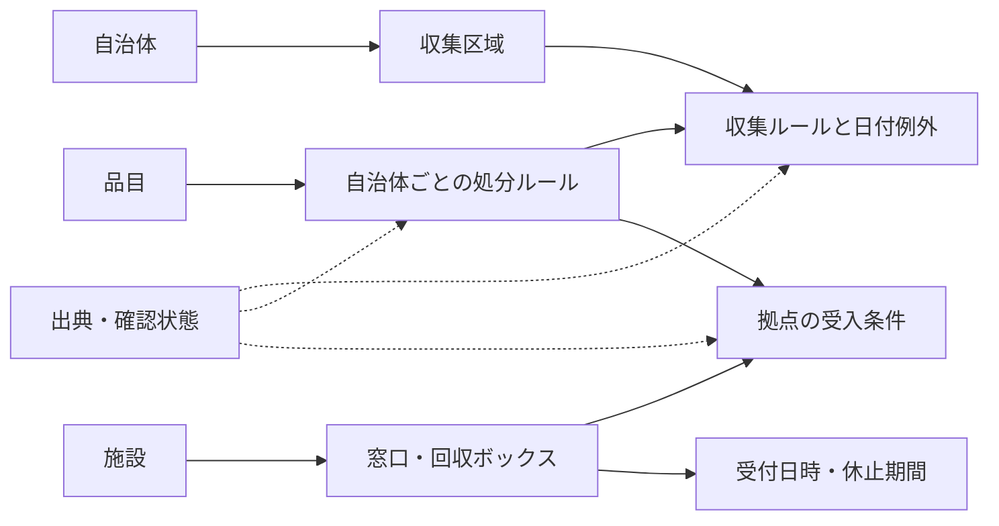

# 全国展開を見据えたデータ設計

状態：2026-10-07。G04で自治体別JSONの[スキーマ1](data-schema-v1.md)、住所・日程・受入条件・根拠・有効期間の判定、同梱fixtureを実装。以下は拡張も含めた全体の概念設計で、全ての候補フィールドや配信・DB・実データを実装済みとする表ではない。保存・配信先は[Cloudflareと端末の設計](data-storage.md)を参照する。

## 原則

全国共通にするのは構造であり、分別ルールそのものではない。自治体固有の区分名、収集区域、特定品目の条件、例外の有効期間を保持する。自治体追加のたびに画面ロジックへ条件分岐を増やさず、データと取得アダプターを追加する。

アプリは確認済みのデータだけを使う。LLMの候補、根拠のない座標、未確認の受入条件を確定データに昇格させない。

## 主な構造

| 概念 | 主要フィールド・関係 |
| --- | --- |
| Municipality | 安定したID、自治体コード体系と値、名称、公式URL、timezone、対応状態 |
| CollectionArea | 自治体ID、区域ID、町丁目、番地条件、通り沿い等の説明、任意の境界形状、設定時の追加質問 |
| WasteCategory | 自治体内区分ID、公式名称、短い表示名、アイコン。色は補助情報 |
| Item | 全国共通の品目ID、表示名、別名。自治体の分別区分とは分離 |
| DisposalRule | 自治体／区域、品目、条件、処分方法、対象区分／サービス、必要な準備、有効期間、根拠 |
| CollectionRule | 区域、区分、曜日・月内の何回目か、締切時刻、有効期間 |
| CalendarException | 特定日・区域・区分、取消／追加／振替／未確認、元ルール参照、根拠 |
| Facility | 施設ID、名称、運営主体、住所、座標と精度・根拠、施設URL・電話 |
| CollectionService | 施設ID、ボックス／窓口、階・設置場所、受付時間、休止・移転、有効期間 |
| AcceptanceRule | サービスID、品目、状態・寸法・メーカー等の条件、対象者、除外条件、準備、根拠 |
| SourceEvidence | URL、発行主体、取得日時、内容ハッシュ、原文位置、原文更新日、適用期間、確認者・確認日、利用条件 |
| DatasetRelease | スキーマ版、自治体別データ版、公開日時、カバーする範囲、検証結果、PR・承認参照、チェックサム |

各条件・規則にも根拠を付ける。施設住所の出典が分かるだけでは、その施設の電池受入条件を確認したことにはならない。

## 収集予定と地域設定

「第1・第3金曜」は月内の金曜日の出現回数として扱い、単純な隔週やISO週番号で計算しない。祝日、年末年始、臨時休止は自治体の個別ルール・日付例外で表す。

日付は自治体のタイムゾーンで計算する。スキーマ1はAsia/Tokyoを対象とし、有効期間は開始日を含み終了日を含まない形式へ固定した。年度を跨ぐ例外を前年からコピーしない。

候補区域の重複・未一致をエラーとして扱い、GPSから境界条件を断定しない。豊島区の「通り沿い以外」等は利用者が確認できる短い説明を保持する。境界ポリゴンだけでは解決しない例外に対応する。

出力は verified_schedule / verified_no_collection / needs_confirmation の3状態を基本とする。対象日・区分・区域の根拠が不明な場合は、データが欠けていることを「収集なし」に変換しない。異常の影響範囲を追跡し、確定している別の日・区域は使えるようにする。

スキーマ1の実装・共有出力では、それぞれ`collection`／`none`／`needsConfirmation`と命名する。上記は概念上の状態名であり、JSONには実装名を使う。

## 回収場所の適合判定

地図への掲載対象と、自治体上の分別区分を分離する。自治体ごとに、電池・小型家電・蛍光灯等の特別な品目について地図掲載対象を明示登録する。単に「資源」に分類されることや、拠点データが存在することを理由に地図対象を増やさない。通常の家庭ごみ・古紙・びん・かん等は予定・分別案内の対象とする。

地図表示は「掲載対象品目に関連するサービス」で絞ってから受入条件を評価する。品目未選択時にもこの範囲を維持し、全サービスを表示しない。地図対象の電池でも通常収集が認められる場合は、DisposalRuleに双方の経路を保持する。

1. 品名・別名から品目候補を決める。
2. 自治体ルールから「自宅の収集」「公開拠点」「申込」「問い合わせ」等の選択肢を得る。
3. その選択肢の受入条件に必要な情報だけを質問する。
4. 条件に合うサービスを選び、休止期間・対象者・受付条件を確認する。
5. 施設単位で地図に表示し、選択したサービスの詳細をカードに出す。

条件の評価結果は accepted / rejected / unknown。情報不足をacceptedにしない。見た目が同じ電池でも、種類・膨張・破損・メーカー等で条件が変わる場合がある。写真AIを追加しても、状態や寸法を根拠なく補完しない。

汎用カテゴリは検索の入口であり、受入可否の証拠ではない。自治体の「資源」という分類名と、拠点の受入品目のリストを別に扱う。公開拠点、利用世帯が決まる集積所、町会の集団回収、店舗回収を区別する。

## 場所・時間の品質

- 座標は公式座標または利用条件を確認した位置データで付与し、住所との照合を行う。LLMに緯度経度を推測させない。
- 同一住所でも施設IDとサービスIDを分ける。同じ施設内の乾電池箱と小型家電箱の受入条件を混ぜない。
- 建物の開館時間と回収受付時間は別フィールド。両者が必要なら共通する時間帯を使う。
- 臨時休止・移転を通常時間より優先する。休止終了予定日が過ぎても、再開確認が取れない場合は自動的に稼働中へ戻さない。
- 距離の計算は拠点の適合判定後。直線距離と徒歩距離を混同しない。経路計算は初期は外部地図に任せる。
- マップ提供者固有の施設IDを自作データの主キーにしない。GeoJSON等へ投影できる座標データを持つ。

## 豊島区から分かる必須ケース

[調査資料](research.md)のT03〜T08を根拠とする。以下は将来も変わらないルールではなく、確認日時点の設計テスト例である。

- 2026年4月開始の充電池収集：適用開始日と収集区分への紐付けが必要。
- 膨張した電池：通常の集積所・一般の箱とは異なる案内が必要。
- 2026年8月開始のボタン電池の箱回収：古い資料との差分と適用日を持つ必要がある。
- 小型家電ボックス：投入口寸法、対象品目、内蔵電池の条件を保持する。
- 工事中の施設や仮施設：サービスの休止・仮移転を期間付きで保持する。
- 2025–26年の年末年始案内：2026–27年の根拠にはできない。

## 配信前の検証

必須項目、ID参照、条件の矛盾、有効期間の重複、区域の重複、座標の範囲、出典・利用条件を検証する。ごみ種別・日程・受付可否を変える差分は人の確認が必要。

データ版は不変として保存し、manifestを検証済み版へ切り替える。端末は取得・検証を完了してから一括で切り替え、途中のデータを表示しない。旧版へ戻せても、有効期間切れの予定を確定表示することは許さない。

生HTML・PDFの保管可否と公開可否は分ける。利用条件が不明な資料をプロジェクトのGPLの対象として同梱しない。ソース登録簿には「公開可／条件付き／要確認」等の状態と、その判断の根拠を持つ。

G02で[豊島区の出典登録簿](sources/toshima.md)と[メタデータ](../data/sources/toshima.json)、利用条件の検査を実装した。G04の公開用CLIはSourceEvidenceの登録ID・URL・ライセンス・再配布状態を登録簿と照合する。これは宣言の整合確認であり、原文の意味や人の承認の証明ではない。取得メタデータを収集予定として読み込まず、自作fixtureだけを同梱・Cloudflare配信し、アプリで取得・保存する。[現在の保存構成](data-storage.md)はファイル／Webキャッシュで、端末DB・実自治体データは未実装。
