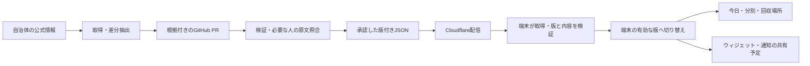

# データの保存・Cloudflare配信・端末利用

状態：2026-10-08。Cloudflareを配信元にする利用者の希望に基づく構成。アカウント保有・独自ドメイン未取得を確認し、[開発用fixtureの初回配信・公開照合](cloudflare-data.md)を完了した。公開するのはJSON・manifest・GPL本文で、実データではない。R2有効化・バケット作成・自動配信ジョブは未実施。端末側は版付きJSON、同梱fixture、読み込み・検証・メモリ内の切り替えまでで、HTTP更新・端末DB／更新ファイルの保存は未実装。

## 保存先の役割

| 保存先 | 内容と役割 |
| --- | --- |
| GitHub `data/datasets/` | 公開・再配布できる整形済みの版付きJSON。根拠と差分をIssue／PRで確認し、承認・履歴を管理 |
| GitHub `data/sources/` | 取得元、取得・確認日時、利用条件のメタデータ。自治体の原文や収集予定とは別 |
| Cloudflareの公開配信領域 | 承認・検証したJSONの同じ版をHTTPSで配信。版の内容を配信先で直接変更しない |
| 取得基盤の非公開領域 | 保管が許可された原文と調査用の記録。公開配信用データと分離し、許可・保持期間に従う |
| 利用者の端末 | 利用する自治体の確認済みデータ、地区・言語・通知設定。オフラインの予定・ウィジェット・通知判定に使用 |

自宅の精密位置・詳細住所・写真をGitHubや配信領域へ送らない。公開データの取得にアプリへ秘密のR2キーを渡す必要はない。位置情報による住所照合の提供者・通信の扱い、配信時のアクセスログと保持は採用方式の確定時にプライバシー文書へ反映する。

## Cloudflareだけ・端末だけとの比較

| 場面 | Cloudflareだけ | 端末だけ | 併用する推奨構成 |
| --- | --- | --- | --- |
| 朝の起動・ウィジェット | 取得の通信待ち・失敗に依存 | 保存済みデータを使える | 通常表示は保存済みデータを使い、更新は別に取得 |
| オフライン | 初めて取得する予定を表示できない | 保存済みの範囲で使える | 保存済みで有効な予定を表示 |
| 日程訂正 | 配信元を更新できる。端末到達は取得・キャッシュ条件次第 | 訂正を届ける別の手段が必要 | 新しい版を取得・検証して切り替える |
| 壊れた更新 | 配信側で保護・復旧が必要 | 以前のデータを保持できる | 取得失敗・検証失敗なら以前の版を維持 |
| 有効期限切れ | 新しいデータを取得できなければ確認が必要 | 古い予定をそのまま確定扱いしない | 保存があっても期限外は「収集予定の確認が必要」 |

併用の理由は、配信元で一括更新することと、起動時の通信依存を減らすことの両方を満たすため。通信が必要な処理を毎朝の表示・ウィジェットの前提にしない。更新の到達や臨時変更の反映は100%保証せず、版・有効期間・取得状態で判断する。

## Cloudflareの第一候補

**R2 Standard＋独自ドメインの配信**を候補とする。公開・再配布できる版付きJSONと、保管を許可された原文を、別の公開／非公開領域へ配置する。R2の独自ドメインはCloudflareのキャッシュに接続でき、`r2.dev`は開発用途のため本番配信先にはしない。[公式の公開バケット](https://developers.cloudflare.com/r2/buckets/public-buckets/)、[R2とキャッシュ](https://developers.cloudflare.com/cache/interaction-cloudflare-products/r2/)

JSONはCloudflare CDNの標準キャッシュ対象ではないため、公開JSONのURL範囲へ明示的なCache Rulesとキャッシュ期限を設定する。版付きの不変JSONと、切り替え用manifestは異なる期限にし、更新後の取得・緊急訂正と読み取り回数を実測する。独自ドメインを付けただけで全JSONがキャッシュされるとは扱わない。[標準キャッシュの公式資料](https://developers.cloudflare.com/cache/concepts/default-cache-behavior/)

2026-10-07確認時点のR2 Standardの月間無料枠は、10 GB-monthの保存、Class A 100万回、Class B 1,000万回。インターネット向けの転送は無料。枠超過は保存と操作の従量課金で、無料枠はInfrequent Accessに適用されない。利用者数・実データ量・書き込み／読み込み回数・他サービスの料金で予算を確認する。[R2公式料金](https://developers.cloudflare.com/r2/pricing/)

公開JSONだけを小規模に配信する場合、Workers Static Assetsも代替候補。静的アセットへの要求と保存は追加料金なしで、Workerコードの呼び出しは別の料金・制限になる。R2を必須のアプリ依存にせず、提供者を変えても同じHTTPS・JSON形式で取得できるようにする。[Static Assets公式料金](https://developers.cloudflare.com/workers/static-assets/billing-and-limitations/)

独自ドメインがない開発段階では、Workersの`workers.dev`で自作fixtureを公開・照合した。R2＋独自ドメインの本番候補と区別し、[認証の準備手順](cloudflare-setup.md)で対象と権限を限定する。交換用トークンで対象Workerの認証・公開照合を確認し、初回Admin失効はメンテナーの完了報告で記録した。[workers.dev公式資料](https://developers.cloudflare.com/workers/configuration/routing/workers-dev/)

データ量が未測定なので、月3,000円以内や完全無料を保証する判断はまだしていない。仮想マシンや常時起動のサーバー、D1等のDBを最初から必須にはしない。契約・料金が伴う設定は、具体的な構成と利用量を確認してから行う。

## 更新の流れ

これは実データについての完成後の流れ。手動の自作fixture初回配信だけを確認した。取得・継続配信・端末更新のジョブは未実装。原文が公開されていることと、GitHub・Cloudflareへ再配布できることは別で、[利用条件の確認Issue](https://github.com/oukiito/gomimap/issues/14)を継続する。

公開版は不変URLに置き、その版・サイズ・チェックサム等を示すmanifestを最後に切り替える設計とする。端末は対象自治体のデータを取得し、全体の検証に成功した後で一括切り替えする。利用者ごとの住所を配信要求へ付けない。以前の版が有効なら失敗時に継続利用し、期限切れなら確認状態に戻る。キャッシュ期限、更新頻度、緊急訂正、明示的なロールバックはG10／G11で実装・検証する。
