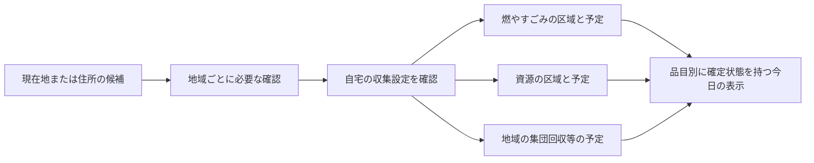

# 全国向けの住所・収集地区の対応設計

2026-10-10。[Issue #69](https://github.com/oukiito/gomimap/issues/69)、#53の1・2・4。利用者の全国展開の指摘を受けた設計修正。現在のschema1とDemoArea A／Bを製品の全国モデルとして固定しない。資料は構造比較のために閲覧したもので、日程データの採用・再配布許可・対応自治体の追加を意味しない。

## 公式資料で確認できる違い

| 例 | 確認できる構造 | 設計への影響 |
| --- | --- | --- |
| 豊島区 | 多言語の曜日表は、同じ丁目を番・号・通り沿い／それ以外で分けている | 町丁目・郵便番号・GPSの一点だけでは確定できない。[多言語曜日表](https://www.city.toshima.lg.jp/documents/15278/youbiitiran.pdf) |
| 横浜市中区 | 同じ町丁目でも通りのどちら側か等で別行。古紙・古布は集積場所の別表示で確認 | 回収方式・品目によって対象区域や根拠を分ける。[中区の例](https://www.city.yokohama.lg.jp/kurashi/sumai-kurashi/gomi-recycle/gomi/shushuyobi/naka/mu-mo.html) |
| 横浜市の集団回収 | 古紙・古布の実施内容は地域団体と回収業者の取決めで異なる | 市の通常収集の住所表から、地域の回収日を推測しない。[公式FAQ](https://www.city.yokohama.lg.jp/faq/kukyoku/shigen/shigen-gyomu/20211020165625087.html) |
| 札幌市北区 | 条・丁目等の住所の組合せからカレンダー番号を選ぶ | 東京の町→丁目→番の固定フォームではなく、その地域に必要な質問を生成する。[住所とカレンダー番号](https://www.city.sapporo.jp/seiso/kaisyu/02_kita/index.html) |
| 福岡市 | 地域別の持ち出し日を案内し、日没から午前0時までに出す夜間収集 | 地区の対応だけでなく、利用者の持ち出し日・受付時間を基準に表示と通知を計算する。[市政だより2026年5月1日号](https://www.city.fukuoka.lg.jp/shicho/koho/fsdweb/reiwa8_dayori/0501/0701.html) |

確認日は上記の日付。現行の豊島区出典登録簿にある別の[曜日PDF](https://www.city.toshima.lg.jp/documents/1056/syuusyuyoubiitiran.pdf)と多言語表の版の一致は、この比較では検証していない。具体的な曜日を製品へ採用する際は、適用版・原文・利用条件を改めて照合する。原文PDFや各市の表全体をこのリポジトリへ転載しない。

住所辞書にはデジタル庁の町字ID等を候補として使えるが、収集区域IDの代わりにはならない。町字より下の情報・地図情報は整備状況が異なるため、「住所データがある＝全国の番・号まで確実に対応できる」としない。[アドレス・ベース・レジストリ](https://www.digital.go.jp/policies/base_registry_address)。導入前の利用条件・データ品質・費用の確認は別途必要。

導入と着手は[人口／外国籍住民数による順位とMR01〜09](municipality-rollout.md)に従う。住宅照合は自治体別詳細調査と設計レビューの後に実装する。本書の構造比較だけでそのゲートを満たしたとは扱わない。

2026-10-10の追加調査で、[MA01〜10の瑕疵点検](municipal-research/matching-audit.md)を追記した。以下の概念設計は同書の所属基準・時間の意味・NC06〜09・A01〜12で補強する。収集目安の時間帯は排出windowではない。日付だけ既知の場合、時間不明を日程不明へ広げない。

## 全国共通にする部分

共通にするのは照合の仕組みであり、住所の粒度や収集曜日ではない。市、行政区、特別区は名前の「区」だけで同じ階層にせず、自治体コード・行政上の親・収集の実施主体を別に保持する。広域の実施主体も自治体の所在地と分けて参照できるようにする。

内部は次の関係にする。利用者へ技術的なIDやこの構造を選ばせない。

| 概念 | 責任・必要な関係 |
| --- | --- |
| AddressReference | 自治体・行政区・町字・必要時の住所要素の参照。住所体系／辞書版・取得精度を持つ。収集日を直接持たない |
| CollectionStream | ごみ種類と回収方式のまとまり。実施主体、categoryIds、通常収集／集団回収等、必須確認項目、対応範囲を持つ。境界や根拠が違えば別stream |
| CollectionArea | そのstreamで使う区域。丁目・番・号・道路・自治会・集積所・カレンダー番号などの単位を表現し、必要なら境界を参照。行政区画と同一とは限らない |
| AssignmentRule | 住所等の確認条件から、streamId／areaId／calendarIdへ対応付ける。根拠・有効期間・membershipFingerprintを持つ |
| CollectionCalendar | その回収方式の周期・日付例外・持ち出し時間。地域名や利用者住所から独立した予定ID |
| HomeCollectionProfile | 本人が確認した自宅設定。表示用の地域参照と、streamごとのbinding（assignmentId・areaId・calendarId・確認状態・確認日時）を保存 |

IDは自治体・リリースの名前空間で一意にし、areaに対応するstreamを明記する。同じ形の区域や日程を複数streamから共有してもよい。全品目の区域を掛け合わせた巨大な一つの地区表を作らず、それぞれ照合して合成する。通常収集と地域回収が同じ品目を扱う場合も別方式として識別し、利用者が選んだ方式だけを予定・通知へ含める。分別規則に区域例外がある場合はその適用範囲を別に根拠照合し、燃やすごみのareaIdを他種別の分類根拠へ流用しない。

## 対応付けの手順

1. GPSは自治体・町字や、根拠を確認した収集区域の候補を絞る補助。郵便番号・住所の正規化結果・最寄りの集積所だけで保存しない。
2. 公開可能な住所／収集条件を、streamごとに照合。通常は同じ住所確認を共用し、必要な差分質問だけ出す。札幌の条・大字／小字等を東京の固定4項目へ押し込まない。
3. 条件は真／偽／不明を保持する。「特定の号以外」「この通り沿い以外」も、未回答の否定を真にしない。番と号、住居表示と地番を区別し、「付近」のような曖昧な原文を勝手な距離へ変換しない。
4. 公式に例外の適用関係がある場合のみ明示した上書き規則を使う。細かい住所だからという理由だけで広い区域の規則を自動上書きしない。同一streamに異なる候補が残れば曖昧、情報が足りなければ追加確認、0件なら未対応／根拠不足を区別する。
5. 配布カレンダー番号、決められた集積所の表示等でしか確定できない場合は、その確認方法へ誘導する。検証済みの公式候補を本人が選ぶことと、曜日を自由入力することは別。自由入力・看板OCRを公式データへ昇格させない。
6. 自宅か、表示した品目別の日程が対応しているかを本人が確認して保存。以後の移動や地図操作では変えない。変更は同じ確認画面を使い、取消・失敗時は旧設定を維持する。

通常ごみの集積所は利用世帯が定まる場合があるため、近い場所へ案内しない。家庭用集積所や建物の情報を、電池等の公開「資源回収場所」地図へ混ぜない。建物ごとの事情を将来表現する場合も、管理者等の根拠・公開範囲を確認してから扱う。建物別の対応を今回実装したものではない。

## 部分的に分かった場合

bindingは`confirmed / needsInformation / needsConfirmation / unsupported / notApplicable / notSelected`を区別する。confirmedは検証済み候補への本人確認が済んだ状態で、自己入力した曜日の信頼区分ではない。unsupportedはアプリ側で対応データを提供できない状態で、選択中なら確認必要として残す。notApplicableは根拠・期間を確認した規則でその世帯が利用対象外と分かった状態。候補0件や未回答だけではnotApplicableにしない。notSelectedは任意の回収方式を利用者が選ばなかった状態で、データ欠落を隠すために使わない。

- 確定した燃やすごみの予定は表示できる。未確認の資源等はその品目を示して「収集予定の確認が必要」と公式情報へのボタンを表示する。分かっている予定を消したり、未確認を収集なしにしない。
- 選択中の方式に未確認があれば、当日全体を「収集なし」とはしない。全て確認できて収集がない場合だけnone。任意方式の明示的なnotSelected、または根拠付きnotApplicableは範囲から除けるが、unsupportedを対象外へ読み替えない。除いた場合は表示範囲を明示し、「登録した収集の予定はありません」等の範囲付き文言を使う。
- 当日の未確認が残っている間は、締切経過を推測して主表示全体を翌日へ飛ばさない。確定した区分の締切経過・次回予定は区分別に扱う。
- 通知は確認済みの区分だけ。未確認の種類を通知せず、既知の通知に「これだけ」とは付けない。全体の確認状態と個々の通知可否を別に判定する。
- 初回に全方式の入力を強制しない。最低1つのconfirmed bindingがあれば、未確認の範囲を説明した確認画面から部分保存して使える。全て未確認なら候補段階のまま、公式確認・住所選び直しへ進む。任意の地域回収は後から設定できる。

画面上部には確認済みの地域名を小さく読める形で維持し、部分保存なら「一部未確認」を添え、タップで品目ごとの設定へ。未確認・対象外・未選択を長い常設説明にせず、必要な確認だけを開けるようにする。色だけでは区別しない。

## UI・UXの理由と確認

| ID | 要素・操作と理由 | 戻る・保持・失敗・確認 |
| --- | --- | --- |
| NC01／LC05 | 地域と方式に必要な質問だけを順に出す。住所体系の違いを利用者に理解させる負担を減らす | 共通回答は共用。上位の住所変更で影響する下位回答を解除。戻る／取消で旧保存を維持 |
| NC02／LC08 | 上部の地域名と部分保存の「一部未確認」。何が確定したかを短く区別する | タップで品目別設定へ。既知の予定は保持し、不明の日をnoneにしない。全方式未確定は保存しない |
| NC03／LC06 | カレンダー番号や公式の確認先を必要時だけ提示。GPSで解けない地域も行き止まりにしない | 自由な曜日入力・OCRは公式確定にしない。本人確認と出典検証を別に扱い、戻れば候補を破棄 |
| NC04／W13・NT | 持ち出し日の夜間を区別し、時間帯に合う通知候補を提示する | 朝6時を押し付けず本人が選択。日付・終了時刻が不明なら自動通知しない。開始が日没などの文言なら「今出せる」と断定しない。表示／通知の詳細UI・全言語・境界試験後に実装 |
| NC05／UP05 | 区域改定で必要なbindingだけを再確認。全設定を最初からやり直させない | 適用日前の有効予定は維持。一意でない新対応を推測せず、影響しない種類と元の用件を保持 |

## 夜間と日付の契約

予定の基準日は**住民の持ち出し日**にする。資料が収集車の日を示す場合は、公式根拠のある変換だけを行う。夜間だから常に翌日の収集と推測しない。

Calendar v2は`putOutDate`と、同日0時からの`start/end`（dayOffsetと時分）を扱う。午前8時締切はend=(0,08:00)、当日夜から午前0時まではend=(1,00:00)で、同日00:00と混同しない。開始が日没等の文言しかない場合は意味／原文の案内を保持し、未検証の固定時刻へ変換しない。終了時刻も不明なら自動締切判定をしない。

夜間の方式を朝10時に翌日へ切り替えず、通知候補も持ち出し日に合わせる。通知設定は朝6時を全国へ一律適用せず、方式の時間帯に応じた候補を示して本人が選ぶ。混在時は必要な時間帯だけ設定できる設計を詳細化してから実装する。通知には確定した持ち出し日・終了時刻と、本人が選んだ終了前の通知時刻が必要。開始が日没等でも「今夜の予定」の事前案内は可能だが、「今出せる」とは通知しない。日付または終了時刻が不明なら自動通知しない。

## 保存・改定・個人情報

DeviceState v2のselectionは、自治体と単一areaIdではなくHomeCollectionProfile全体を持つ。binding集合・対応するreleaseId／番号・言語・通知希望を一つの確定stateとして保存し、世代を共有する。通知・ウィジェットの照合もprofileの世代と対象binding／calendarまで確認する。

membershipFingerprintは対象世帯を決める条件・対象stream・有効な区域対応を識別する。曜日／例外の訂正と、区域の分割・統合・対象世帯変更を分ける。予定だけの承認済み更新はそのまま再生成。所属が変わる場合は、根拠付きの対応表で一意に引き継げる場合だけ移行し、分割で一意に決まらなければ該当bindingだけ再確認にする。町名が似ている・IDが同じというだけで移行しない。

適用日より前は有効な旧対応、適用日から新対応／再確認を使う。旧版のまま有効期限を延長しない。候補を開いている間に所属条件が変われば、保存前に再照合する。保存・反映・中断時の復旧はD5の単一確定と世代の契約を維持する。

精密住所・GPSは照合後に破棄し、住所回答を恒常保存しない。ただしassignmentId等でも細かな住所や集積所が推測できる可能性があるため、IDを匿名情報と呼ばない。自宅profileは端末内の私有データで、公開Issue・ログ・データ配信要求へ含めない。配信は自治体単位とし、家や集積所ごとのIDをURLパラメータへ付けない。

## 現在の実装と製品設計への修正

現在の`resolveArea`／`ScheduleCalendar`は一つのareaIdを選び、区域×区分のbaselineから予定を作る。番等の追加条件や区分ごとに違う曜日は表現できるが、異なる区域体系を持つ複数方式の設定・部分確定・夜間の窓は実装していない。一つのbaseline欠落で日全体が確認必要になる点も、部分確定の合成には拡張が必要。

[実装前の契約](implementation-readiness.md)D1の製品bundleは一つの検証済みリリースとして維持し、内部calendarはschema1の固定再利用から**Calendar v2の別契約**へ変更する。v2にはstreams／areas／assignmentRules／calendars／coverageを設計し、既存のitems／categories／facilities／services／sourcesとの参照を維持する。GeoPackもareaがどのstreamに対応するか照合する。schema1へ未定義キーを足さず、fixtureの既存loaderは維持する。

Calendar v2／HomeCollectionProfileの完全なJSON定義・codec、部分予定の本体／通知／ウィジェット投影、夜間の通知UIは追加の開始ゲート。全国向けloader・製品DeviceState・GPSの区域照合を先に実装しない。既存の純粋な分類判定核は地域の前処理から独立しており、その検証済み入力契約を維持する。

2MiBは初版の配信上限で、全国の全ての自治体が収まる保証ではない。大きな自治体では分割と一括確定の方式を測定して別途設計する。上限に合わせて番・号の例外や境界を落とさない。

## 先に確認する自作fixture

実データの転載や公式日程の採用をせず、次の構造を自作の架空地域で確認する。同じ評価器・UIで動き、自治体名によるコード分岐を増やさないことを合格条件にする。

| ID | ケース | 期待値 |
| --- | --- | --- |
| N01 | 同じ丁目で番・号・道路条件により分岐 | 番だけ一致しても号／道路未回答なら候補。補集合の未回答を真にしない |
| N02 | 条・丁目等から公式カレンダー番号を選ぶ方式 | 必要な質問だけ生成し、番号の確認後に保存 |
| N03 | 燃やすごみと資源で区域の分け方が異なる | stream別の正しいcalendarへ結び、区域の掛け合わせを手で増殖しない |
| N04 | 市収集は確定、集団回収は未確認／未選択 | 既知の予定を保持し、未確認をnoneにしない。表示範囲と通知の対象が一致 |
| N05 | GPS境界・職場・近隣の別集積所 | 自宅や利用資格を推測保存せず、確認／住所代替 |
| N06 | 区域の分割・統合と適用日 | 一意の根拠付き移行だけ自動。曖昧なbindingだけ再確認 |
| N07 | 夜の持ち出しと月末・年末の午前0時 | end=(1,00:00)、期限経過・通知日がずれず、朝10時で翌日にしない |
| N08 | 異なる方式の一部更新、設定保存中の版変更・終了 | 新旧bindingを混在させず、profile全体を同世代で復旧 |

豊島区は先行検証として確認できた区域・種類から。以後の導入候補は総人口を主基準とし、同人口時だけ外国人住民数を使う。自動設定できる範囲、住所確認が必要な範囲、まだ扱えない範囲を別々に公開する。導入候補を広げる前に、上記の異なる方式で設計の成立を確認する。近隣や資料の容易さを理由に、合意した人数順位を黙って変更しない。「全国へ拡張可能な構造」と「全国の正しいデータを運用できる状態」は別の到達点とする。
