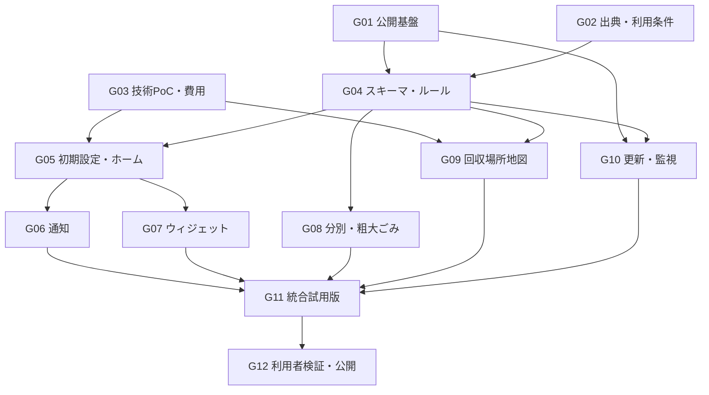

# 開発計画・Issue

状態：公開リポジトリでG01〜G12をIssueとして管理し、Flutter CIとmainの保護を設定済み。G02で[豊島区の出典登録簿](sources/toshima.md)と利用条件の検査を実装。一般Web資料の再利用条件の未確認部分は[Issue #14](https://github.com/oukiito/gomimap/issues/14)で追跡する。G03のローカル画面・ルールPoCと地図ライブラリ移行は実施済み（[作業記録](work/README.md)）、実機PoCは未完了。G番号は元のローカル作業IDであり、以下に実際のIssueへのリンクを記録する。期限の合意はない。

## 作業順序

公開前に行ったG03のローカルPoCは作業記録を残し、実Issue #3へ対応付けた。今後の本実装は該当Issueに範囲・検証方法を記録してから着手する。G02の登録簿を根拠にG04のスキーマとルール実装へ進む。再利用条件の回答が必要な部分は#14で追跡し、架空の試験データで開発を継続する。G03の未完了部分も並行して検証できる。

## Issueと受け入れ条件

UI・UXの共通基準は[Issue #16](https://github.com/oukiito/gomimap/issues/16)、[ペルソナ](personas.md)、[画面・遷移の設計](ux-design.md)で管理する。G05〜G09の実装では画面・遷移の理由を更新し、G12では同書の利用者試験を実施する。設計書の完成をUI実装や利用者検証の完了とは扱わない。

| ID／タイトル | 内容・受け入れ条件 | 検証 |
| --- | --- | --- |
| [G01 公開リポジトリと開発基盤 #1](https://github.com/oukiito/gomimap/issues/1) | owner/name・権利者を確認。Git／リモート、GPL-3.0-or-later、貢献案内、秘密情報対策、テンプレート、基本CI、PRルールを整備 | テストPRでCIとルールの実動作を確認。文書リンクと公開対象を点検 |
| [G02 豊島区の出典・再利用条件を整理 #2](https://github.com/oukiito/gomimap/issues/2) | 通常曜日、区域例外、特別日、分別、拠点、受付条件のソース登録簿を作る。保管／再配布の条件を別々に確認 | 公式資料と照合。利用条件不明の資料が公開データへ入らない |
| [G03 地図・通知・ウィジェットのPoC #3](https://github.com/oukiito/gomimap/issues/3) | Flutterで両OSの地図、ピン、位置候補、通知、共有データ、ウィジェットを動かす。対応OS、提供者、パッケージ版を記録 | 実機で権限拒否・再起動・文字拡大・日付変更を確認。100／1,000／10,000利用者の費用試算 |
| [G04 スキーマと日程・受入ルール #4](https://github.com/oukiito/gomimap/issues/4) | 自治体／区域／日程例外／施設／サービス／条件／根拠／有効期間を実装。豊島区の試験データを用意 | 月内第1・3曜と隔週の違い、5回ある月、年跨ぎ、境界住所、不明状態を検証 |
| [G05 初期設定と今日の画面 #5](https://github.com/oukiito/gomimap/issues/5) | 位置／住所選択→地域確認→通知説明。ホームに今日・明日・複数区分・公式リンク。端末保存と原子的更新 | 未対応地域、GPS曖昧、ネットなし、期限切れ、地域変更を確認 |
| [G06 通知 #6](https://github.com/oukiito/gomimap/issues/6) | 当日6時候補・変更可能、前夜20時任意。収集なし／未確定日は種別通知なし。データ更新で再予約 | 同日複数区分、時刻変更、重複防止、取消・権限拒否・再起動・未受信訂正の限界を記録 |
| [G07 両OSのホーム画面ウィジェット #7](https://github.com/oukiito/gomimap/issues/7) | 日付と今日の内容／次回／指定の確認文言。ピン留め任意、タップで詳細 | 両OSで日付跨ぎ、アプリ未起動、文字拡大、複数区分、データ期限切れを確認 |
| [G08 分別検索と粗大ごみ案内 #8](https://github.com/oukiito/gomimap/issues/8) | 別名検索、必要な寸法等の質問、除外品、公式申込先。写真AIと申込代行は含めない | 寸法不明、家電リサイクル対象、電池内蔵、地域ルール不明を誤断定しない |
| [G09 特別な品目の回収場所地図 #9](https://github.com/oukiito/gomimap/issues/9) | 電池・小型家電・蛍光灯等の掲載対象を登録。品目選択、必要条件確認、ピン、密集整理、補助カード、公式情報、外部経路、代替一覧 | 乾電池と充電池、膨張品、受入資格、時間不明、休止、仮移転、該当なし、地図通信失敗を確認。品目未選択時も通常のごみ・資源の収集場所が混ざらない |
| [G10 取得・差分PR・独立監視 #10](https://github.com/oukiito/gomimap/issues/10) | 週次通常／日次お知らせ／月次LLM。根拠付き差分、検証、人の承認、版公開、外部heartbeat | 空本文、構造変化、LLM失敗、未承認差分、重複PR、予定ジョブ未実行を故意に起こし検知する |
| [G11 豊島区の統合試用版 #11](https://github.com/oukiito/gomimap/issues/11) | 公開可能なデータを同梱・配信。地図・ホーム・通知・ウィジェットを同じ版で同期 | 年末年始未確定、異なる版、オフライン、破損更新、ロールバック。内部配布・プライバシー表示を確認 |
| [G12 利用者テストと一般公開 #12](https://github.com/oukiito/gomimap/issues/12) | 5人程度のテストと修正。出典・ライセンス・運用・ストア申告・問い合わせ先を整備 | 下記公開ゲートの記録が揃い、人が一般公開可否を判断する |

## 一般公開ゲート

| ゲート | 必要な記録 | 現在 |
| --- | --- | --- |
| 地域と日程 | 区域例外、月2回、年度変更、特別日を含む照合結果 | 未実施 |
| データ利用条件 | 公開対象ごとの利用根拠と出典表示 | 未確認 |
| iOS／Android | 実機・OS・試験手順・結果・残る制約 | 未実施 |
| 利用者 | 5人程度の実施結果、つまずき、修正後の再確認 | 未実施 |
| 収集予定 | 不確かな日の指定文言・公式リンク・通知制御 | 未実施 |
| 地図 | 電池等の特別な品目に合う場所と受付条件を手助けなく見つけられる。通常のごみ・資源の収集場所を表示しない | 未実施 |
| 運用 | 週次／日次／月次、未実行検知、通知先、ロールバック | 未構築 |
| 費用 | 実測利用量と月額見込み、制限の試験 | 未実施 |

通知の到達を100%保証する基準ではなく、端末状態別の動作と限界を把握し、誤案内を減らす基準とする。利用者を確保できない場合は試用版を継続する。

## 初回後の拡張

第二自治体では豊島区と異なるルール・データ形式を選び、取得アダプターとデータの追加だけで対応できるか検証する。地域ごとに「対応済み／準備中」を管理し、データ未検証の全国対応を表示しない。

写真AI、ロック画面ウィジェット、現在の対応言語以外の追加言語、家族同期、複数住所、店舗独自回収は別Issue群にする。対応言語の切り替えは利用者の追加依頼でローカルPoCに実装済み。対応一覧はプロダクト仕様を参照。写真AIは運用費・正確性・プライバシーの検証後に判断し、初回完成の条件へ戻さない。
