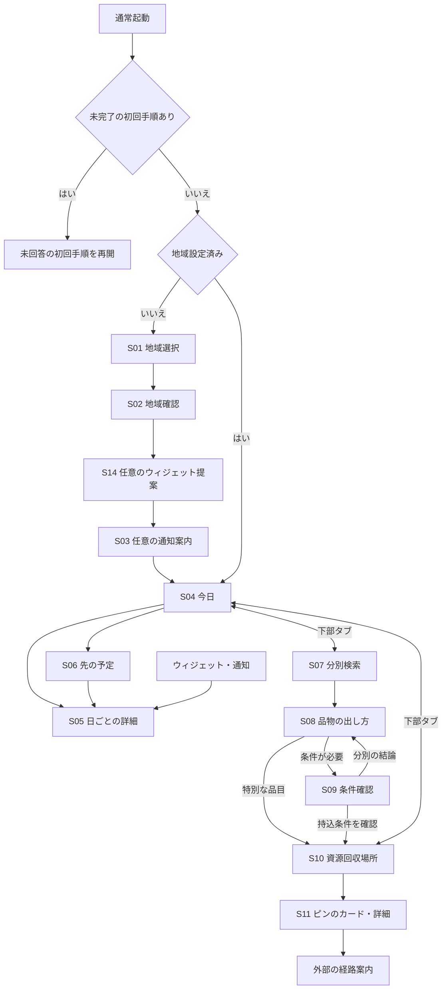

# UI・画面遷移の設計

状態：2026-10-08更新。利用者の要望と既存仕様に基づく設計。AIによる[模擬操作と修正](ux-evaluations/2026-10-08/report.md)を実施したが、人の使いやすさの検証は未実施。配置・操作の仮説や全画面の設計を、実装完了と扱わない。関連：[Issue #16](https://github.com/oukiito/gomimap/issues/16)。提供範囲は[プロダクト仕様](product-spec.md)、想定利用者は[ペルソナ](personas.md)、実装状況は[README](../README.md)を参照する。

## 判断基準

残る機能の操作・状態・戻る・失敗・確認方法を2026-10-09に具体化した。[設計の入口](remaining-design.md)からNT・LC・IW・RC・UPとVの受け入れ試験へ進む。追加した設計は未実装機能の完成を意味しない。

データ取得・保存中の表示と状態保持は[更新時の設計図 D01〜D06](ux-data-refresh.md)に記録する。

最初の意味のある画面・Androidの起動表示・実機での速度評価は[起動時の設計図 P01〜P04](ux-startup.md)に記録する。

Androidウィジェットの締切を読める長さにする理由、次回を含む名称、言語の同期は[W18〜W20](ux-android-widget.md)へ記録。専用エミュレータの日英の実画面と回帰試験は[Maestroの検証記録](work/2026-10-09-maestro-ui-poc.md)を参照する。

画面・文言・操作・遷移は、それぞれ「誰が、どの場面で、何を判断・実行するために必要か」を説明する。単に「見やすい」「便利」だけを理由にしない。利用者の目的を妨げる箇所、誤解しやすい情報、検証前の想定をIssue・PRで指摘する。

| ID | 設計方針と理由 | 検証 |
| --- | --- | --- |
| UX01 | 設定後の通常起動は「今日」。毎朝の利用者が画面や日付を選ぶ手間をなくす | 今日の全区分と締切をスクロール・操作なしで読み取れるか |
| UX02 | ウィジェットと通知はアプリと同じ区域・日程・確定状態を使う。手軽な表示ほど誤案内を避ける必要がある | 日付変更、複数区分、不明、期限切れ、アプリ未起動を両OSで確認 |
| UX03 | 分別結果は「区分 → 準備 → 次の行動」。区分名を知るだけではごみを出せない | 品物に合う出し方と次の行動を利用者が説明できるか |
| UX04 | 地図は品目と受入条件で絞り、ピン選択後に補助カードを示す。近さだけでなく、出せる場所を選ぶため | 対象品目・時間・利用資格を満たす拠点を選べるか |
| UX05 | 現在地は候補、最後は自宅地域の確認。移動先・境界の誤りが毎日の予定に影響するため | 位置拒否、境界、住所例外でも正しく設定できるか |
| UX06 | 不明と収集なし、未確認と受入不可を分ける。情報不足を「出せない／出せる」と誤認させない | 指定の確認文言と公式導線が理解されるか |
| UX07 | 言語・文字拡大・読み上げ・地図代替一覧を用意する。同じ用件を異なる読み方・操作で完了できるようにする | 各言語、拡大文字、VoiceOver／TalkBackで主要用件を確認 |
| UX08 | 宣伝・意味のない見出し・不要な確認操作を置かない。朝の判断に使う注意と復旧案内を優先する | 各文言が判断・操作・誤案内防止に役立つかレビュー |
| UX09 | 収集地区を各画面で控えめに常時表示し、後から変更できる。どの地区のルールかと設定の誤りを確認するため | タブ移動・スクロール・詳細・文字拡大後も地区が読め、変更・取消ができるか |
| UX10 | 初回にウィジェットを提案し、追加／スキップを選べる。毎朝の起動を減らす方法を知らせ、日々の確認を邪魔しない | 初回だけの提案、OS追加・取消・非対応、設定からの再追加を確認 |

「操作なし」は地域設定済み・有効なデータがある通常状態での目標。初回設定、極端な文字拡大、多数の区分、異常時には必要な操作やスクロールを認め、情報を省略して目標を満たさない。

## 画面と役割

S番号は設計の参照ID。モーダル・下部カードも含み、独立した画面ファイルやページの実装を要求する番号ではない。各画面の動作は、次節のT番号で確認する。

| ID／画面 | 最初に示す内容・主要操作 | 配置と操作を採る理由 | 関連方針・試験 |
| --- | --- | --- | --- |
| S01 自宅地域の選択 | 現在地から探す／住所から選ぶ。右上に言語 | 初回に必要なのは自宅の予定。位置許可と日本語を必須にしない | UX05・07、U1 |
| S02 地域確認 | 候補地域・収集予定の例、必要な住所条件、保存／選び直す | 自動確定せず、誤った地域を利用者が発見できる。番地等は必要な区域だけ確認 | UX05、U1 |
| S03 通知の案内 | 6時を候補に、時刻・有効化／あとで | 予定を覚える負担を減らすが、許可を初回利用の条件にしない | UX02・08、U1・U6 |
| S04 今日 | 地域、日付・曜日、今日の全区分、締切、必要な準備。続いて明日・次回 | P1の朝の判断を最優先。今日と明日を視覚的・文章上で区別する | UX01・06、U2・U3 |
| S05 日ごとの詳細 | 対象日、区分ごとの準備・出し方、根拠、戻る | ホームを長文で埋めず、詳しく確認したいときに読む。通知・ウィジェットの対象日も照合できる | UX02・03、U2・U6 |
| S06 先の予定 | 日付別の予定と確定状態、日を選んで詳細 | 月2回や先の予定を探せる。毎朝の入口をカレンダー操作にしない | UX01・06、U2・U3 |
| S07 分別検索 | 入力欄、品名の具体例、結果の品名と出し方への導線 | P2は行政区分より手元の品物から探す。別名・表記ゆれを吸収 | UX03・07、U4 |
| S08 品物の出し方 | 品名、区分、準備、次回日／専用回収先／公式申込先 | 調べた後に何をするかを明確にする。寸法・種類・状態が必要なら先に条件確認 | UX03・04・06、U4・U5 |
| S09 条件確認 | 受入を左右する種類・寸法・状態と「分からない」 | 誤った箱や粗大ごみ申込へ進ませない。結論に不要な質問はしない | UX04・06、U4・U5 |
| S10 資源回収場所 | 品目の絵と文字、必要条件、地図、現在地／一覧 | P1・P2が位置関係を把握する。電池など特別な品目に限定し、一般の集積所は出さない | UX04・07、U5・U7 |
| S11 回収拠点のカード・詳細 | 施設名、受付時間、条件、行き方。展開すると階・箱の位置、準備、公式情報 | ピンと詳細の対応を保ち、行く前に受入可否を判断する。閉じても地図の位置を維持 | UX04・06、U5・U7 |
| S12 設定・情報 | 自宅地域、通知時刻・状態、ウィジェット案内、データ確認状態、出典・プライバシー・ライセンス | 日常画面を設定項目で埋めず、見直す場所を一つにする | UX02・05・08、U6 |
| S13 言語選択 | 各言語の原語名と選択状態。右上の地球アイコンから開く | 日本語を読めなくても見つけられ、切替のために今の用件を失わない | UX07、U4・U7 |
| S14 ウィジェットの提案・追加案内 | 初回のプレビュー、追加／スキップ、OS別手順、戻る | 起動せず確認する方法を知らせる。追加自体は必須にせず、設定からも利用可能にする | UX02・08・10、U6 |

共通の収集地区表示と、初回の位置取得・地区確認・ウィジェット提案の要素一覧・配置例・理由は[初回設定の設計図](ux-initial-setup.md)B01〜B21に記録する。S14は初回にプレビューと追加／スキップを示す画面としても使い、追加自体は必須にしない。S01は初回の目的を説明した上で現在地からの候補取得を主な導線にする。

S10の一覧は地図の代替表示であり、タブを増やす別機能ではない。S11はまず小さなカードで地図を残し、必要なときに詳細を広げる。長文や文字拡大では全画面も許容し、内容を隠さない。モーダルには見える「閉じる／戻る」を用意し、下スワイプだけを閉じ方にしない。

## 遷移と主要操作

日常のタブは「今日」「分別を調べる」「資源回収場所」の3つ。利用者の用件を直接選べるようにする。設定と言語は全てのアプリ内画面から利用できる構成を目標にする。

図は主要導線。言語・設定、閉じる、失敗時の復旧、外部ページからの復帰は下表を含めて仕様とする。未設定でウィジェット等から開いた場合はT01へ進み、地域を推測して予定を表示しない。

| ID | 起点 → 操作・遷移先 | 理由／保持する状態・戻り方 |
| --- | --- | --- |
| T01 | 通常起動 → 未完了の初回手順があれば再開、それ以外は未設定ならS01、設定済みならS04 | 地区保存と初回完了を分け、S14未回答等を飛ばさない。完了後の毎朝の地域選択は不要。S04は端末内の有効な予定から表示 |
| T02 | S01 → 現在地を選択 → 許可・候補 → S02 | 利用目的を理解してからOS許可を求める。拒否・失敗なら同じ画面の住所選択へ進める |
| T03 | S01 → 住所選択 → S02 | 位置情報を使わない代替。住所例外は必要な候補だけ追加質問。不明・未対応は自宅設定を確定しない |
| T04 | S02 → 保存 → 初回S14、地域変更時は元の用件へ | 確認した区域だけ保存。初回はウィジェット提案へ。変更時はタブ・品名を保持して新地区のルールを再評価。キャンセルは従来の地域、失敗は再試行可能にする |
| T05 | S03 → 有効化／あとで → S04 | 拒否しても本体機能を使える。有効化時だけOS許可。拒否を許可済みと表示しない |
| T06 | 3つのタブ間の移動 | 用件を一度のタップで選ぶ。検索語・品目・条件・地図中心を同じセッション内で保持し、初回の説明を繰り返さない |
| T07 | S04／S06 → 日を選ぶ → S05 | その日の準備を詳しく確認する。戻ると元の日付・スクロール位置。S04の主要情報はタップ前にも読める |
| T08 | S04 → 先の予定 → S06 | 先の日付が必要な人だけカレンダー等を開く。戻るとS04。収集なしなら次回の表示もS04内に残す |
| T09 | 各タブ上部の収集地区表示／S12 → S01・S02で地域変更 | 誤設定・引越しを意図的に修正できる。保存後は旧地区の条件・日程を再評価し、通知を再予約、ウィジェットを同期。地図移動・旅行では変更しない |
| T10 | S07 → 検索語入力 → 結果更新 | 送信ボタンを必須にしない。日本語の別名と選択言語の品名を対象にし、未登録なら別名・公式案内へ進める |
| T11 | S07 → 結果を選ぶ → S08 → 戻る | 品物に対応する出し方だけを読む。検索語・結果・位置を維持して比較・修正できる |
| T12 | S08 → 必要な条件だけS09 → 結果へ戻る | 自治体ごとの寸法や除外品を確認。回答は結論のそばで見直せる。不明なら断定せず公式の確認先を示す |
| T13 | S08 → 専用の回収場所 → S10 | 品目と互換性のある回答を引き継ぎ、再選択をなくす。適合に必要な未回答はS09で確認 |
| T14 | S10 → 品目を変更／条件を回答 → ピン更新 | 選んだ品目に合う場所を表示。地図の品目を変えたら地図側の前の品目専用回答を解除。元のS08の品物・回答は別に保持。未回答・不明を受入可と扱わない |
| T15 | S10 → ピン／一覧の施設を選択 → S11 | 両表示から同じ施設・条件へ到達。別のピン選択でカードを更新。閉じると地図中心・品目・条件を維持 |
| T16 | S11 → カードを展開／閉じる | 簡単な判断と詳しい受付案内を分ける。詳細を閉じると選択した施設のカードへ戻る |
| T17 | 検索から開いたS10 → 戻る → 元のS08 | 元の品物と回答を復元し、地図で変更した別品目で上書きしない。データ版が変わっていれば結論を再評価。タブから開いた地図に架空の戻り先を作らない。S07へ戻ると検索を保持 |
| T18 | S10 → 現在地／地図移動／一覧切替 | 表示範囲だけ変更する。現在地の許可は押したときに求め、拒否なら保存地域の地図を使う。自宅区域は不変 |
| T19 | S11 → 行き方 → 外部地図アプリ | 確認済み拠点の所在地を渡す。戻るとS11。開けないときは住所を表示・コピーできる。未確認・休止拠点へは経路推薦しない |
| T20 | S05／S08／S09／S11 → 対象の公式情報 → 外部ページ | 該当ルール・日付・品目・施設の根拠へ進む。非日本語UIではリンク先言語を示す。復帰時は元の用件を維持 |
| T21 | 各画面 → S13で言語変更／キャンセル | 選択後は同じ画面・品目・回答で表示を更新。キャンセルは変更なし。保存失敗を伝え、次回起動で保持されるとは表示しない |
| T22 | 各画面 → S12 → 通知設定／S14／情報確認 → 戻る | 日常の画面を設定で埋めない。通知は時刻・対象・オン／オフを保存後に反映。OS側で無効なら状態と設定を開く導線を示す |
| T23 | 通知／ウィジェットをタップ → 対象日のS05 | 表示を見て開いた日を照合。対象日が過去なら絶対日付と現在の状態を示し、「今日」へも戻れる |
| T24 | 設定S12 → S14 → OSに応じた追加／手順 → 戻る | 初回にスキップしても後から追加できる。地区・言語を引き継ぎ、案内を読んだだけで追加済みと扱わない |
| T25 | 閉じる／OSの戻る／アプリへ復帰 | 詳細やモーダルは直前の用件へ。タブ直下の戻る挙動はOS慣習に合わせて実機検証し、品目等を破棄する隠れた操作にしない |
| T26 | 前面復帰・日付変更・データ更新 → 表示を再評価 | 日付と有効範囲を再確認。検索・条件確認の途中で「今日」へ強制移動しない。ホームの今日、通知、ウィジェットの元データを一致させる |
| T27 | 初回のS14 → 追加／手順／スキップ → S03 | アプリを開かず確認する方法を知らせる。選択後は提案を繰り返さない。地域未確定では提案しない |
| T28 | S14 → 対応Androidの追加要求 → アプリ復帰 | OSの追加処理へ渡す。要求受理を配置成功とせず、取消・未確認でも先へ進める。復帰時に自動再要求しない |
| T29 | S14 → iPhone／非対応Androidの手順 → 戻る・あとで | 自動配置を約束せず短い手順へ。地域を選び直させず、完了未確認でも本体を使える |

通常起動と通知等からの起動を区別する。OSが既存画面を復元する前面復帰ではT26を優先し、作業中の検索・詳細を勝手に閉じない。保存時の失敗や更新中は、表示中の地域と予約済み通知が異なる状態を放置しない。原子的な更新は[データ設計](data-design.md)に従う。

## 状態・文言・アクセシビリティ

| 状況 | 表示と操作 | 理由 |
| --- | --- | --- |
| 今日の収集あり | 全区分、日付、締切、必要な準備。複数区分を省略しない | ひとつだけ出して他を忘れる誤解を防ぐ |
| 収集なしが確認済み | 「今日は収集なし」と確認済みの次回 | 不要なごみ出しを防ぎ、次の準備につなげる |
| 収集予定不明・有効期限外 | 「収集予定の確認が必要」＋対象の公式情報。断定する種別通知を止める | 「収集なし」と取り違えさせない |
| 締切後 | 締切は残し、収集済みとは断定しない | 締切と実際の収集車の到着を混同しない |
| 条件未回答・不明 | 確認する質問・相談先。適合する拠点として表示しない | 品物を置ける場所が確定していないため |
| 条件確認済みで該当拠点なし | 検索範囲と掲載情報の限界、広域／公式検索への導線 | 未掲載を「どこにも存在しない」と断定しない |
| 拠点休止・受付条件未確認 | 推薦対象から外し、判明している状態と公式確認先を示す。全て除外された場合は「確認済みの回収場所がありません」と、掲載範囲内に休止／未確認の拠点があることを別々に示す | 近くても受け付けない場所への移動を防ぐ。情報不足を不存在に置き換えない |
| 地図通信失敗 | 取得済みの有効な拠点の一覧・住所・条件、再試行 | 背景地図が見えなくても用件を続けられる |
| 公式リンクを開けない | URLを選択・コピーできる形で表示し、再試行 | 行き止まりを避ける |
| 架空データの試作 | 実際には利用できない注意を常時表示 | 試作品を実際のごみ出しに使う誤解を防ぐ。宣伝ではない |

品物の図・アイコンと短い文字を併用し、色だけでごみの種類や選択状態を区別しない。「資源」は必要に応じて対象品目の具体例を添え、外国人住民に区分名だけを覚えさせない。施設の原表記と住所は外部地図・現地表示との照合に使う。

本文は短い手順に分け、固定高さで切らない。200%相当の文字拡大、長い訳文、狭い画面、ソフトキーボード表示時にも主要操作へ到達できることを試す。地球アイコンと設定アイコンには読み上げ名とツールチップを付ける。地図ピンは一覧から同じ情報を読めるようにし、ピンやモーダルへ移ったときのフォーカス順も確認する。

主要なタップ領域は両OSで48×48論理ピクセル以上を設計目標とする。Androidの[公式アクセシビリティ案内](https://developer.android.com/guide/topics/ui/accessibility/apps)は48×48dp以上を推奨している。Flutterの寸法、各OSの単位、WebのCSSピクセルを同一の適合基準と扱わず、実機の操作性を確認する。確認日：2026-10-06。

## 現在の試作との差・優先する改善

以下は2026-10-08時点の`app/lib/main.dart`等との照合。理由を後付けして全画面が完成しているとは扱わない。締切・閉じる・戻る・品目未選択の詳細理由は[ナビゲーション設計N01〜10](ux-disposal-navigation.md)へ記録。

| 現状／課題 | 利用者への影響と改善 | 担当Issue |
| --- | --- | --- |
| #20でサンプルの初回手動選択・確認・保存・途中復帰、変更の確認・取消・保存失敗復旧を追加 | 実住所・位置で自宅の予定を設定する機能とS03は未実装。S14のAndroidは[W08〜11](ux-android-widget.md)へ実装。詳細の理由は[初回設計B22〜33](ux-initial-setup.md) | [#20](https://github.com/oukiito/gomimap/issues/20)・[#5](https://github.com/oukiito/gomimap/issues/5) |
| 地区表示は#18で3タブの固定表示・変更導線、品物／拠点詳細・設定の対象地区を試作に追加。#20で未設定・候補・保存済みを区別 | 本物の区域解決は未実装。小さい文字でも読めるか実機・利用者検証が必要 | [#18](https://github.com/oukiito/gomimap/issues/18)・[#5](https://github.com/oukiito/gomimap/issues/5) |
| #23で今日・明日のJSON締切を表示。複数区分で異なる締切を残す。準備、日詳細・先のカレンダーは未実装 | 試作の時刻であり、実時間の原文照合と、準備・次回の使いやすさは後続 | [#23](https://github.com/oukiito/gomimap/issues/23)・[#5](https://github.com/oukiito/gomimap/issues/5) |
| G04で今日・地区確認の予定例を同じ版付きJSONへ接続。欠落・期限切れ・未確認は収集なしにせず公式確認へ | P1・P2が確認と通常利用で異なる予定を見ない。理由と検証は[初回設計B34〜36](ux-initial-setup.md)。実地区・通知・iOSウィジェット接続は後続 | [#4](https://github.com/oukiito/gomimap/issues/4)・[#5](https://github.com/oukiito/gomimap/issues/5) |
| 全ての公式ボタンが同じ総合ページを開く | P2が目的の情報を再度探す。対象のルール・品目・施設へリンクする | [#5](https://github.com/oukiito/gomimap/issues/5)・[#8](https://github.com/oukiito/gomimap/issues/8)・[#9](https://github.com/oukiito/gomimap/issues/9) |
| 多言語UIはあるが検索対象はサンプル品物。ルール翻訳の確認未完了 | 翻訳された画面だけではP2の分別を解決できない。別名・具体例・出し方を言語別に確認 | [#8](https://github.com/oukiito/gomimap/issues/8)・[#12](https://github.com/oukiito/gomimap/issues/12) |
| #23で直接開いた回収場所は品目未選択。充電池の未回答／不明では件数を表示しない | 品目の誤適用と未判定を0件とする誤解を防ぐ設計。条件は膨張・破損確認中心で、受入サービスAPI接続は後続 | [#23](https://github.com/oukiito/gomimap/issues/23)・[#9](https://github.com/oukiito/gomimap/issues/9) |
| 拠点詳細は架空情報、一覧が地図の下に常設 | 受付可否や時間を判断できない。地図中心・ピンの補助カード・代替一覧にし、試験データで条件を実装 | [#9](https://github.com/oukiito/gomimap/issues/9) |
| #23で検索経由の地図に元の品物へ戻る操作とOS戻るを追加。検索語・元の回答と地図側の別品目を分離 | 用件の復元を自動回帰とブラウザで確認。人による発見・データ版変更時の再評価・実機は後続 | [#23](https://github.com/oukiito/gomimap/issues/23)・[#8](https://github.com/oukiito/gomimap/issues/8)・[#9](https://github.com/oukiito/gomimap/issues/9) |
| #23で品物・拠点・設定の詳細に見える閉じるを追加し、文字拡大と全言語の回帰を確認 | 人による操作発見と読み上げ・実機のフォーカス復帰は未検証 | [#23](https://github.com/oukiito/gomimap/issues/23)・[#5](https://github.com/oukiito/gomimap/issues/5) |
| 設定にAndroidウィジェット追加を実装。Android初回案内と締切後の次回表示は[W01〜W17](ux-android-widget.md)。Android通知は[NT](ux-notifications.md)に部分実装。iOSは未実装 | 通知の設定見直しは後続。Androidの実データとiOSの表示・追加を後続で確認 | [#5](https://github.com/oukiito/gomimap/issues/5)・[#6](https://github.com/oukiito/gomimap/issues/6)・[#7](https://github.com/oukiito/gomimap/issues/7) |

UI実装の順は、今日と初期設定、分別の出し方、条件に合う回収地図。通知・ウィジェットは同じ日程データから実装する。データの権利確認やネイティブPoCの依存は[開発計画](roadmap.md)に従い、先に進められる画面・ルールは架空データで検証する。

締切後の主表示・今日の補助表示・2×2と操作の理由は[Androidウィジェット W13〜W17](ux-android-widget.md)。試作のタップ先は本体の「今日」タブで同じ現在時刻を再評価し、対象日詳細S05の通知動線は[NT11〜12](ux-notifications.md)に部分実装。Androidウィジェットのタップ先は引き続き今日。検索の入力と確定地区を保持する。

## 利用者試験

未実施。以下は最初の観察に使う手順・仮の目標。架空データを使う場合、実際の収集・持込が可能とは案内しない。参加者に「地域設定」「分別を調べるボタン」等の操作名を先に教えず、用件だけを伝える。

| ID | 用件・条件 | 観察する成功条件 |
| --- | --- | --- |
| U1 | 初めて利用し、架空の自宅地域を設定。位置許可拒否・境界候補・誤設定の修正も試す | 手助けなく適切な地域を確認して保存。読める言語を選べる。ウィジェット・通知を断ってもホームへ到達 |
| U2 | 朝に起動／ウィジェットを見る。複数区分、収集なしの日を含める | 描画完了から5秒程度を暫定目標に、今日の全区分と締切、収集なしなら次回を正しく読み取る |
| U3 | 年末年始等で収集予定が不明な日を見る | 「収集なし」と誤解せず、公式確認が必要と説明して確認先を見つける |
| U4 | 選択言語で品物を検索。別名、粗大ごみの寸法・除外品、分からない回答を試す | 区分だけでなく準備と次の行動を説明。未知の情報を推測せず、必要な確認へ進める |
| U5 | 電池等の品目で回収先を探す。条件未回答、不明、破損、受付時間不明、休止を含める | 品目・条件に合う場所と受付情報を見つける。近いだけの不適合拠点を選ばない。検索から戻って品物を見失わない |
| U6 | 初回のウィジェット追加・スキップ・取消・非対応、設定から再追加、通知オフ／時刻変更、過去日の通知を試す | 初回の選択後は勧め直さない。要求と追加完了を混同しない。地区・言語を引き継ぎ、追加を強制しない。OS権限とアプリ設定を区別 |
| U7 | 地図の通信失敗、文字拡大、読み上げ、途中の言語切替で用件を続ける | 一覧で同じ受付条件に到達。重要情報が切れず、閉じる・戻るが使える。言語変更で選択を失わない |

5秒は使いやすさの仮説で、起動性能の保証ではない。読み取り時間と起動・描画待ち時間は別に記録する。精度を犠牲にして達成させない。誤った区分・地域・受入先を選ぶ問題、不明の断定、重要情報の欠落は所要時間より優先して修正する。

各試験は参加者ID、使用言語、スマホ／分別の経験、OS・端末、文字サイズ、アプリ・データ版、用件、時間、誤り、手助け、本人の説明、問題、修正と再確認を記録する。公開記録に個人の住所や写真を含めない。少人数での成功率を一般利用者全体へ推計しない。

## 設計を変更するとき

Issue・PRには該当するP／UX／S／T番号、困りごと、変更理由、別案との負担の違い、検証方法と未実施事項を記載する。既存IDは別の意味に使い回さず、新しい画面・操作には理由と試験を追加する。小さな文言変更も、何の判断を助けるか説明する。

使いやすさの指摘は、該当画面・利用場面・具体的な迷いや誤操作・推奨する修正と確認方法に落とす。利用者の希望、外部資料、コード確認、利用者の観察結果を分け、観察していない効果を実証済みと書かない。

外部UI試験用の固定IDと、既存の読み上げ・操作を保持する理由は[Maestro準備 QA01〜05](work/2026-10-09-maestro-preparation.md)に記録する。試験用属性は画面へ技術文言を追加せず、予定カードの複数操作を一つの読み上げ操作へまとめない。
