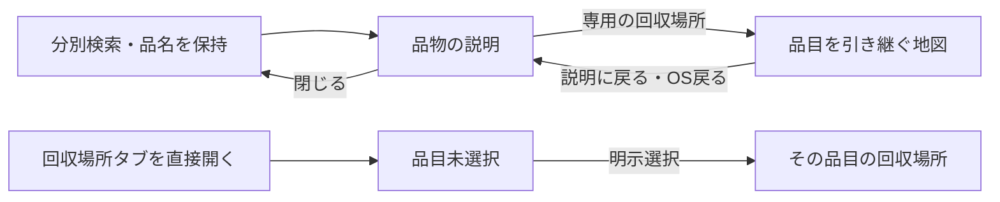

# 今日の締切・詳細の閉じる・品物へ戻る設計

状態：2026-10-08。関連：[Issue #23](https://github.com/oukiito/gomimap/issues/23)。[AI模擬操作](ux-evaluations/2026-10-08/report.md)で画面上の事実を確認し、試作へ実装した。[全体設計](ux-design.md)のUX01〜07、S04・07〜13、T06・13〜17・25を参照する。実データ・実機・人の評価は未完了。

## 要素・操作の理由

| ID | 要素・操作 | 利用者への理由 | 確認 |
| --- | --- | --- | --- |
| N01 | 今日・明日の収集カードへJSONの締切を表示 | P1が朝に何時までに出すかを別ページで探さず判断する | 収集日は時刻を表示し、不明・収集なしでは時刻を確定表示しない |
| N02 | 全区分の締切が同じなら共通の1行、異なるなら区分別 | 重複情報を減らしつつ、別の区分の締切を隠さない | 複数区分・異なる時刻・原文名・全言語で表示を確認 |
| N03 | 品物・拠点・設定の詳細に「× 閉じる」 | 外側タップ・ドラッグを知らなくても、現在の画面から戻る方法を見つける | 48×48以上、文字拡大・読み上げ名、検索／選択の保持 |
| N04 | 詳細は文字拡大に合わせてスクロール可能 | 長い訳文でも内容と閉じる操作へ到達できる | 390×844・200%文字・十言語で画面切れや行き止まりがないか |
| N05 | 検索の品物から開いた地図に、品名付きの「説明に戻る」 | P2がどの品物を調べていたかを失わず、一覧から探し直さずに戻る | 検索語・元の品物・元の回答を復元。地図で別品目を選んでも元を上書きしない |
| N06 | 地図からOS戻るでも元の品物へ。直接タブで開いた地図には作らない | 戻る操作を慣れた方法で使い、存在しない履歴へ戻さない | 検索経由／直接タブ／タブ変更で戻る先を確認 |
| N07 | 検索、直接開いた地図、品物から開いた地図のスクロール状態を分離 | 別の用件の途中位置を新しく開いた画面へ引き継いで、見出しや操作を見失わない | タブ再訪は状態を保持し、新しい品物の入口はその画面の文脈から始まるか |
| N08 | 直接開いた回収場所は品目未選択、短い選択案内 | 乾電池を自動選択したまま別の電池を持ち込む誤りを減らす | 明示選択前は場所を表示せず、選択後は対象品目だけに絞る |
| N09 | 充電池の状態未回答／不明では検索結果の件数を表示しない | 未判定を「0件・回収先がない」と取り違えない | 未回答・ある／不明は通常の場所案内を出さず、公式確認を残す |
| N10 | 品物の詳細からの地図は品目を引き継ぐ | 直前に選んだ品物を再選択する負担をなくす | 明示選択した品目だけを引き継ぎ、別品目へ切替時は地図側の前の回答を解除 |

締切は架空JSONの例であり、実際の豊島区の時間ではない。試作警告は維持する。実データを導入する際は、時刻の根拠・期間・対象区域を原文と照合する。

品目が選択され、充電池なら「損傷なし」が回答済みの場合だけ、試作の対象場所数を表示する。この条件で対象が0件なら0件と「場所が見つからない」案内・公式確認を表示する。未選択・未回答・不明を0件へ変換しない。架空データの0件は実地域に持込先がないという判定ではない。

## 状態と戻り

検索経由では、元の品物とその回答を地図側のフィルターとは別に保持する。タブを意図的に変更した場合は、元の品物へ戻る履歴を解除する。詳細の閉じる後は元の検索語・選択状態を維持する。地図の受付判定・施設情報・タイル接続はG09の後続であり、この変更で実拠点を確認済みにしたものではない。
