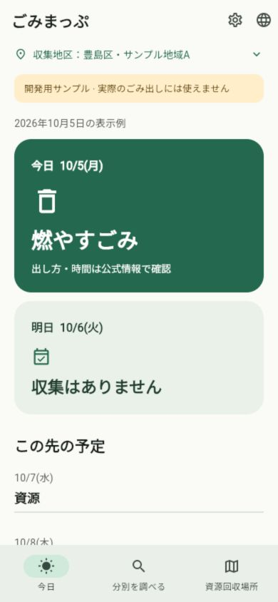
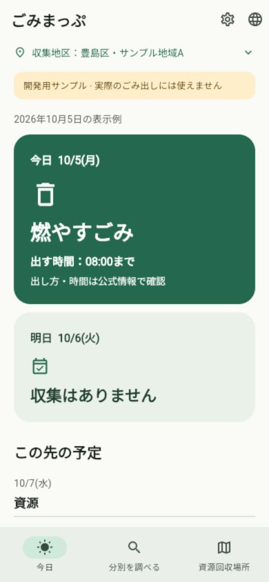
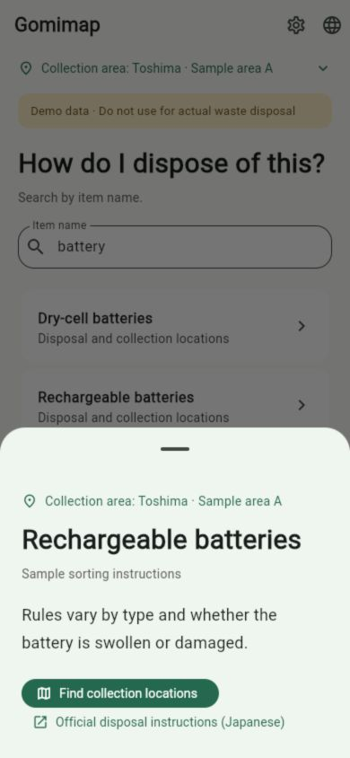
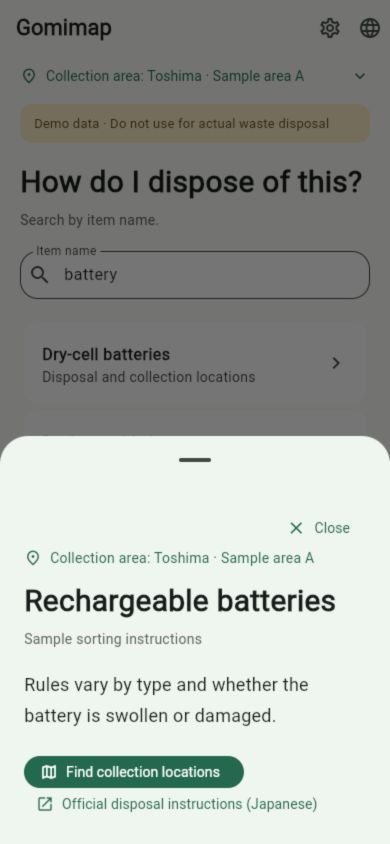
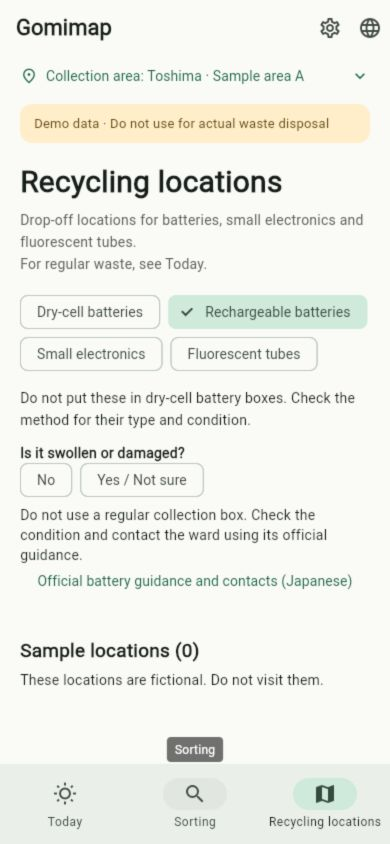
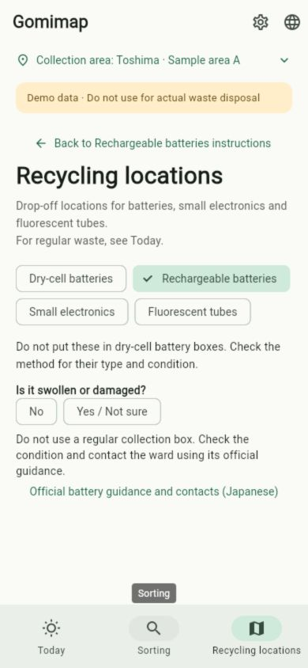
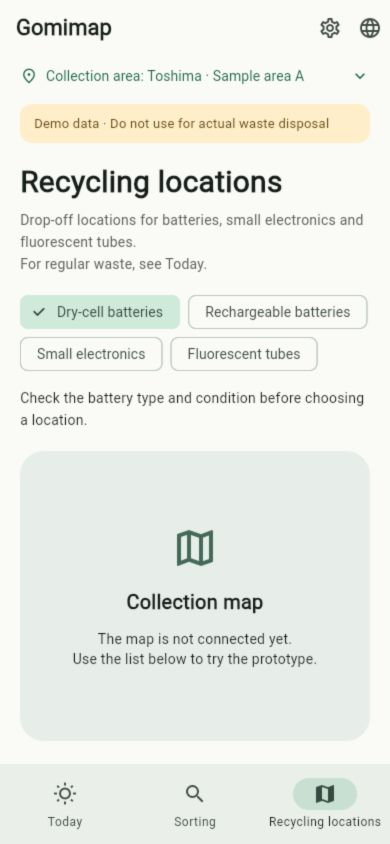
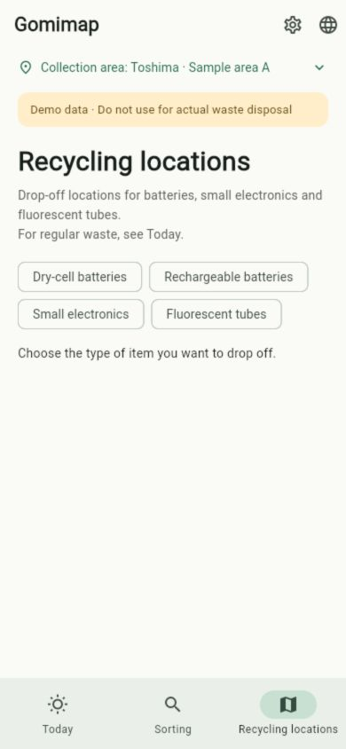

# ペルソナ想定のAI実操作とUI修正

日付：2026-10-08（Asia/Tokyo）。関連：[Issue #23](https://github.com/oukiito/gomimap/issues/23)。[評価手順](../../ux-ai-evaluation.md)、[変更の理由N01〜10](../../ux-disposal-navigation.md)を参照。

## 評価の条件・限界

実行主体は開発担当のAI（Codex）。修正前にソース・設計・ペルソナを読んでおり、初見の独立したAI評価ではない。A1／A2／A3の3つの状況を同じAIが順に想定した。3人の参加者や、人間の気持ち・好み・読解速度を再現した結果ではない。実際の利用者観察は未実施。

対象はWeb版の開発用fixture、データ版`toshima-demo-v1`、表示例2026-10-05、地区A。修正前commitは`04abf0a`、修正は`codex/23-persona-ui`。390×844のブラウザ幅・標準文字サイズで実操作し、200%文字・十言語はFlutter回帰テストで確認。実機・指の操作感・視力・翻訳話者の内容理解を検証したものではない。

修正前は独立した開発用オリジンで初回設定から開始した。修正後は既存オリジンが古いJSを利用したため、最新JSを配信していることをバイト比較で確認し、別の新しい開発用オリジンで同じ地区を設定して再評価した。元のサイトデータを消していない。ポートの変更はテスト環境の更新確認で、製品の更新対策を実装したものではない。

## 用件と結果

| 条件／用件 | 修正前の画面・操作の事実 | 修正後の確認 | 利用者への影響の仮説 |
| --- | --- | --- | --- |
| A1：指定地区を設定し、今日の区分・締切を確認 | 地区A→確認→保存で今日へ到達。燃やすごみは読めるが時刻はなく、公式で時間を確認する案内のみ | 同じ地区の表示例に08:00までを表示。日本語・英語で確認 | 朝の締切を別ページで探す手間が減る可能性。時刻はfixtureで、実際の区の時間ではない |
| A1：不明の日程を見分ける | 10/8に「収集予定の確認が必要」と公式操作を表示。収集なしと異なる | 表示を維持。日程・欠落・期限の既存回帰テストも通過 | 不明を休みと誤解しにくい可能性。人による読み取り確認は未実施 |
| A2：英語へ変更しbatteryを検索 | 言語アイコン→English→Sorting→batteryで乾電池／充電池の2候補を表示 | 同じ操作を再実行し結果を確認 | AIが実行できたが、日本語を読めない人の言語発見能力・理解を証明しない |
| A2：充電池の説明→回収場所→元の説明 | 品目は引き継がれるが、元の説明への直接操作なし。Sortingタブ→充電池を開き直す必要がある | 品名付きの戻る操作で充電池の説明を再表示。地図で蛍光灯へ変えても元の説明は充電池。閉じた後もbatteryを保持 | 調べていた用件を見失わず、探し直す操作を減らせる可能性 |
| A3：詳細を画面上の操作で閉じる | 外側タップ・ドラッグ／アクセシビリティのDismissは存在。ただし画面にCloseの文字・×操作なし | 品物のCloseを押し、検索語・候補が残ることを実操作で確認。拠点・設定のCloseは自動回帰で確認 | ジェスチャーを知らない人にも戻る手がかりになる可能性 |
| A3：回収場所タブを直接開く | 品目未選択なのに乾電池が選択され、2件の架空場所を表示 | 全品目未選択で種類を選ぶ案内のみ。場所・件数を表示しない | 別の電池でも乾電池の箱へ進む誤りを減らせる可能性 |
| A2：充電池の状態未回答・不明 | 普通の箱へ進まない警告はあるが、同時に0件を表示 | 未回答でも不明の回答でも、通常の場所・件数を出さず公式確認を維持 | 条件未判定を「近隣に回収先がない」と取り違えにくい可能性 |

元の品物の回答復元、OS戻る、直接タブからの地図に履歴を作らないこと、タブ・検索／地図の文脈分離、複数区分の締切は自動回帰で確認。ブラウザで全ての条件を人と同等に検証した記録ではない。

## 画面証拠

| 修正前 | 修正後 |
| --- | --- |
|  |  |
|  |  |
|  |  |
|  |  |

## 自動確認と後続

Flutter全121テスト、静的解析、整形、Webビルドが成功。新しい操作は全対応言語・200%文字でも確認した。新しいライブラリや有料AI APIは追加・呼び出ししていない。GitHub CIはPRに記録する。

人によるU1〜U7、実機、翻訳話者確認は未実施。GPS・通知・ウィジェット・実データ・地図タイル・実拠点への経路・完全な受入判定の画面接続は未実装。架空の回収先発見を、実際に訪問できる場所を見つけた成功として数えない。

次回の独立評価には会話履歴・ソース・正解の経路を渡さない操作役を使い、現在の開発AIの評価と区別する。人の試験では朝の締切の読み取り、Close／戻るの発見、電池の種類選択と不明の理解を観察する。同じAIの再実行により経路が既知になる偏りは残る。
