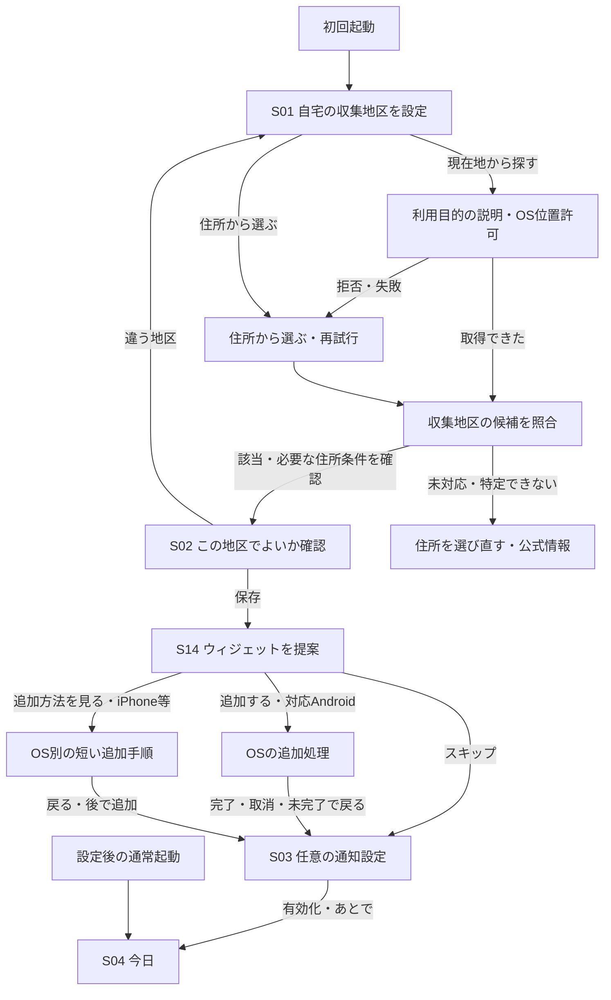

# 初回設定・収集地区表示・ウィジェット追加の設計図

状態：2026-10-08。関連：[Issue #18](https://github.com/oukiito/gomimap/issues/18)・[Issue #20](https://github.com/oukiito/gomimap/issues/20)。地区の常時表示・変更、初回の手動選択・確認・保存・途中復帰は架空地区の試作に実装。Androidウィジェット・初回案内は[W01〜W17](ux-android-widget.md)に実装。Androidの任意通知案内・回答保存は[NT](ux-notifications.md)に実装。GPS・住所解決、iOSウィジェットは未実装。全画面の理由一覧は[UI設計](ux-design.md)、対象利用者は[ペルソナ](personas.md)を参照。

## 初回の流れ



ウィジェット提案は地域を確認した後に置く。地区が決まる前に追加を求めると、空の表示や別地域のごみを示すおそれがある。任意の通知設定より先に提案し、通知の許可を出さなくても、起動せず予定を見る方法を選べるようにする。

未対応の地区や収集区域を確定できない場合、架空・近隣の区域を保存してこの流れを完了させない。公式情報への導線と住所の選び直しを示す。予定ウィジェットを確定した地区の表示として追加する提案も保留する。

## 画面の構成例

以下は配置の説明。地区名・ごみ・締切は例で、実際の豊島区の予定ではない。文字拡大時は折り返し、固定行数で切らない。

```text
通常のアプリ画面
┌────────────────────────────────────┐
│ ごみまっぷ                  設定 言語 │
│ 収集地区：豊島区・○○地区           ▾ │ ← 控えめな文字／スクロール外
├────────────────────────────────────┤
│ 今日の日付・曜日                     │
│ 今日出す全区分                       │
│ 締切・必要な準備                     │
│                                     │
│ 画面の内容だけをスクロール             │
├────────────────────────────────────┤
│ 今日       分別を調べる    資源回収場所 │
└────────────────────────────────────┘

初回のウィジェット提案
┌────────────────────────────────────┐
│ 収集地区：確認・保存した地区           │
│ ごみの予定をホーム画面に表示           │
│                                     │
│ [日付・地区・今日／次回のプレビュー]    │
│ アプリを開かずに確認できます。         │
│                                     │
│ [追加する／追加方法を見る]            │
│ [スキップ]                           │
└────────────────────────────────────┘
```

## 全ての要素・操作に付ける理由

B番号は本設計図の要素・操作ID。既存のS／T番号と併せて実装・PRの参照に使う。装飾を加える場合も、判断・操作を助ける理由と確認方法を追加する。

| ID | UI・操作 | 利用者への理由 | 確認方法 |
| --- | --- | --- | --- |
| B01 | 初回に「自宅の収集地区を設定」と表示 | 現在地を旅行先や職場の予定へ自動適用せず、何の地区を設定するか伝える | 自宅以外で初回設定しても目的を理解できるか |
| B02 | 「現在地から探す」を主な操作、「住所から選ぶ」も同じ画面 | 入力の負担を減らし、位置を使えない・使いたくない人にも完了方法を残す | 位置拒否・端末位置オフ・通信なしから住所選択へ進めるか |
| B03 | 押した時点で目的を説明し、必要な位置許可を求める | 理由の分からないOSダイアログを初回に連続表示しない | 許可前に何に使うか説明できるか |
| B04 | 測位後は候補を出す。取得中は進行状態・戻るを示す | GPSの誤差や境界のずれを隠して予定を確定しない。取得待ちを行き止まりにしない | 取得失敗・キャンセル、境界・重複候補で未確認の予定を出さないか |
| B05 | 自治体だけでなく、必要な町丁目・番地・通り沿い条件を確認 | 同じ区内でも収集日が違うため、「豊島区」だけでは日程を決定できない | 区域例外の架空住所で正しい収集区域を選べるか |
| B06 | S02に地区名・対象条件・予定の例と「この地区で設定」「選び直す」 | 誤候補を確認・修正してから保存できる。手間を増やす確認はこの決定点に絞る | 違う候補を発見し、戻って修正できるか |
| B07 | 通常画面の上部に「収集地区：…」を常時表示 | 表示中の分別・日程がどの地区のルールか分かり、設定ミスに気付ける | 全タブでスクロール後も見えるか |
| B08 | 地区は本文より小さめの文字、十分なコントラスト、折り返し | 今日のごみを主役にしつつ、地区を読めなくしない。小さい文字と小さい操作領域を混同しない | 試作は14論理pxを基準に拡大可能。200%文字拡大・長い訳文を確認 |
| B09 | 地区表示は広いタップ領域と下向き矢印で変更可能にする | 誤入力・引越しで直す場所を見つけやすくする | 48×48以上の操作領域、読み上げ名、後からの変更完了を確認 |
| B10 | 設定にも地区の変更、詳細には対象地区を表示 | 表示行を操作だと気付かない人も直せる。モーダルがヘッダーを隠しても対象地区を見失わない | 設定・分別詳細・拠点詳細で同じ地区を確認できるか |
| B11 | 地区変更は確認・保存まで従来の地区を保持 | 試しに候補を開いたり、キャンセルしただけで予定を変えない | 選び直し・取消・保存失敗後の地区と通知を確認 |
| B12 | 地図を動かす・旅行・再起動で自宅地区を変えない | 一度設定した家庭のルールを、日々の現在地へ置き換えない | 移動・現在地ボタン・起動後も地区IDが不変か |
| B13 | 初回だけウィジェット提案を表示 | 毎朝の確認をアプリ起動なしで済ませる方法を知らせ、毎回の勧誘で邪魔しない | 初回の選択後、通常起動では提案しないか |
| B14 | 確認済み地区のウィジェットをプレビュー | 「ウィジェット」という用語を知らなくても、何が見えるか判断できる | 今日・複数区分・収集なし・予定不明を本体と同じ版で表示するか |
| B15 | 「追加する」から可能な範囲でOSの追加処理を呼ぶ | 設定アプリ等を探す負担を減らす。OSが必要とする確認は利用者が行う | 対応Androidの追加・取消・不支持ランチャーを実機確認 |
| B16 | iPhone・非対応Androidは「追加方法を見る」と短い手順 | 自動配置できるように見せず、実行できる最短の方法を提示する | 選択・プレビュー・地域設定をやり直さず追加できるか |
| B17 | 「スキップ」を常に表示し、押すと次へ | ホーム画面を変えたくない人、後で試す人も本体を使える | 追加・OS確認なしで通知案内／今日に進めるか |
| B18 | 地区・言語・日程データを本体から引き継ぐ | ウィジェットで地域を設定し直す負担と設定不一致をなくす | 地区・言語変更後、本体とウィジェットの版が一致するか |
| B19 | 追加要求・手順表示・追加完了を区別 | ボタンを押しただけで「追加済み」と誤表示せず、取消にも対応する | 要求失敗・確認未完了・取消・OSからの復帰を確認 |
| B20 | スキップ後も設定から追加できる | 初回の決定を永久的な制限にしない。毎回の再提案は不要 | 設定から追加を再試行でき、重複要求を連続送信しないか |
| B21 | 未設定／候補／保存済みをラベルでも区別 | 仮の候補を恒常的な収集地区と誤認させない | 未設定に架空の初期値を使わず、保存するまで確定扱いしないか |
| B22 | 試作の地区選択に「サンプル」と利用不可の表示 | 開発用の選択を自宅の実地区設定と誤認させない | 初回・変更・確認画面の全てで架空と分かるか |
| B23 | 初回に地区を自動選択せず、地区名を大きな選択ボタンで示す | 初期値を自分の予定として使う誤りを防ぎ、選ぶ対象を読みやすくする | 未設定で今日へ進まない。全訳・200%文字で選べるか |
| B24 | 確認画面は候補名・日付付きの予定例・保存／選び直し | 保存される地区と表示内容を確認し、誤った候補から戻れる | 候補の段階で通常の日程へ進まない。別の候補を保存できるか |
| B25 | 初回の候補と確認段階を保存し、再起動で確認へ戻る | 途中で終了しても入力を繰り返さず、確認を飛ばさない | 確認前の再起動で同じ候補を示し、保存後は今日へ進むか |
| B26 | 保存中は選択・保存・戻る・取消を一時的に止め、処理中を示す | 二重保存や保存途中の別地区への移動を防ぐ | 遅延する保存で要求が1回。完了後は操作できるか |
| B27 | 保存失敗をスクロール外・読み上げ対応の文で示し、同じ画面から再試行 | 保存したと誤認せず、作業を最初からやり直さずに済む | 初回・変更の失敗で候補／旧地区を保持し、文字拡大でも理由が見え、再試行で進めるか |
| B28 | 変更画面に旧地区をスクロール外の小さな文字で示す | 新しい候補と現在の設定を区別し、変更前の地区を見失わない | 確認中・スクロール後も旧地区が読めるか |
| B29 | 変更には戻るアイコンと「キャンセル」 | アイコンやOSの戻る操作に不慣れでも、変更せず元の用件に戻れる | 候補選択後の取消でタブ・検索語・旧地区を保持するか |
| B30 | 初回確認のOS戻るは選び直し、後からの変更の戻るは取消 | 初回に未確認の予定へ入らず、修正中は以前の状態へ帰れる | 戻るで意図しない設定変更が起きないか |
| B31 | 選択／確認は全面のスクロール画面、段階変更で上端へ戻す | 文字拡大でも内容と操作を読み切り、新しい画面の候補を見落とさない | 小画面・全言語・200%文字で到達でき、候補名から読めるか |
| B32 | 初回から右上に共通の言語アイコン・母語名 | 日本語が読めない人も設定を始める前に表示を変えられる | 地区未選択で言語を変更し、確認画面にも引き継ぐか |
| B33 | 不正・未対応の保存形式は選び直しと復旧理由を示す | 壊れた設定や古い値を地区Aへ黙って置き換えない | 不正な新設定があるとき旧形式の値へ戻らず、未設定になるか |
| B34 | 今日・地区確認の予定例を同じ検証済みJSONから生成 | 確認した地区の予定と利用開始後の予定が食い違わないようにする | JSONの曜日を変えた試験で今日の内容が変わる。両画面が同じ版を参照するか |
| B35 | 欠落・期限切れ・未確認は既存の確認文言と公式ボタン | データがない日を「収集なし」と思ってごみを出せなくなる誤りを防ぐ | JSONがない・必要日程が欠ける・根拠が期限切れのケースで種別を確定しないか |
| B36 | 確認済みの共通訳がない区分はデータの原文名を保持 | 自治体固有の区分を別の意味へ自動翻訳して分別を誤らせない | displayKey未登録の区分名を原文で表示し、既存十言語の画面を壊さないか |
| B37 | 保存成功後の遷移中は確認画面と処理中を保持 | 成功した直後に地区選択が一瞬表示される混乱と、遷移中の二重保存を防ぐ | 確認から今日へ戻るアニメーション途中に選択画面が出ず、保存要求が1回か |

## 試作へ実装した初回の動作

実住所や位置による照合がない現在の試作は、サンプル地区の手動選択→確認→保存→対応Androidで初回ウィジェット提案→今日までを提供する。製品版で予定するS01・S02の一部を検証するための動作で、上の製品フロー全体の完成ではない。GPSの取得だけを実装して架空地区へ対応付けることや、実際には追加できないウィジェットを提案することはしない。

地区変更にも同じ確認画面を使う。変更中の候補は保存せず、保存成功時だけ旧地区を切り替える。初回に限り、未回答の確認を再開するため候補を端末へ保存する。初回の「選び直す」は保存済み候補を解除し、変更中の「選び直す」は旧地区を変更しない。

`demo.setup.v1`にバージョン・段階（`choose`／`confirm`／`districtSaved`）と必要なサンプル地区IDを1つのJSON値として保存する。`districtSaved`は**地区を確認した状態だけ**を意味し、ウィジェット・通知の初回手順を回答済みと扱う値ではない。`widget.offer.answered.v1`で回答を別保存。新規の地区保存前に未回答を永続化し、保存失敗では進めない。従来の地区保存済み試作への移行は再提案せず設定から追加する。

旧`demo.area`が有効なA／Bなら既存利用者の選択を引き継ぐ。新キーが存在する場合は新キーだけを読み、不正・将来の未知形式なら復旧説明と未設定へ戻す。試作設定は実地区IDへ流用しない。保存失敗時は確定済みのメモリ状態を保持し、保存ライブラリの先行キャッシュを再読み込みする。通知・ウィジェットとの一括更新や、OS保存の永続性保証を実装したものではない。

## 地区設定の保存・変更

製品では`municipality_id`と`collection_area_id`、区域を解決する必要条件とそのデータ版を基本に保存する。測位座標は候補照合に使い、不要な精密位置・位置履歴を恒常的に保存しない。逆ジオコーディング先・外部への送信は方式確定後に説明し、現在地を取得できることと正しい収集区域へ対応付けられることを区別する。

候補が複数ある、古い位置しか取れない、精度が不十分、町丁目でも決定できない場合は追加確認・住所選択へ進む。未対応自治体を最寄りの対応区域に寄せない。失敗しても位置許可を繰り返し自動要求しない。

後からの変更では、地区表示または設定から同じ地区選択を開く。候補・住所を確認し保存した場合だけ切り替える。分別検索の品名や現在のタブは保持する一方、旧地区固有の条件判定・日程・通知は新地区に照らして再評価する。詳細画面上の地区ラベルを押して突然設定へ移す必要はなく、閉じて共通表示または設定へ戻れる。

本体の確定保存は原子的に行うが、OSの通知・ウィジェット操作を同時に確定できるとは扱わない。旧通知の取消確認→本体の確定→共有投影→新通知登録を、世代とpendingで復旧できるようにする。[更新の調整 UP01〜05](update-coordination.md)。地区変更だけで初回ウィジェット提案を再表示したり、二つ目のウィジェットを追加要求したりしない。

## ウィジェット追加のOS別動作

確認日：2026-10-06。以下は公式API・手順に基づく設計で、ネイティブ動作の実測結果ではない。

| OS・状況 | 追加操作 | 設定の引き継ぎ・完了扱い |
| --- | --- | --- |
| Android：ピン留め要求に対応 | サポートを確認して`requestPinAppWidget`を呼び、ランチャーの追加処理に渡す | 自宅地区・言語を準備済み。要求が受理されただけで追加済みとせず、成功コールバック等で確認 |
| Android：非対応・要求失敗 | ホーム画面から追加する短い案内へ | 戻る／スキップで先へ。地域を選び直させない |
| iPhone | ホーム画面から追加する手順を示す。標準の内容・地域・言語はアプリが設定する | 公開WidgetKit APIではアプリからホーム画面へ配置する操作を確認できないため、自動配置を約束しない。手順表示・完了ボタンだけを配置確認の証拠にしない |

根拠：[Android AppWidgetManager](https://developer.android.com/reference/android/appwidget/AppWidgetManager)、[Apple WidgetCenter](https://developer.apple.com/documentation/widgetkit/widgetcenter)、[Appleの追加手順](https://support.apple.com/ja-jp/118610)。iPhoneの配置の扱いは、公開APIの機能一覧と公式手順からの判断。採用する最低OSと実機PoCで再確認する。

アプリがホーム画面の座標やアイコン配置を決めること、OS・ランチャーの確認を省略すること、未確認の追加を成功扱いすることは仕様に含めない。利用者が選んだ後は、地区・言語・ごみの日程を再入力することなく、OSが提供する追加方法へつなぐ。

## 一度だけの提案と復帰

初回フローの進行状態、ウィジェット提案への選択、実際の配置確認は別々に扱う。

起動時は未完了の初回手順の有無を地区保存状態より先に判定する。地区を保存済みでもS14等が未回答なら、その段階を再開する。初回の任意手順で回答・スキップを終えた後の通常起動は「今日」へ直接進む。地区設定済みという理由だけで未回答のS14を飛ばさない。

- 「スキップ」・追加要求・追加手順への移動は提案への回答として端末へ保存し、通常起動で勧め直さない。
- 回答前にアプリが終了した場合は、未完了の初回フローとして同じ段階から再開する。起動のたびに別の勧誘を重ねない。
- OS追加処理へ移った後の復帰では、要求を自動で再送しない。未完了でも次へ進め、設定から再試行可能にする。
- Androidで取消されると成功通知が来ない場合がある。成功待ちで初回フローを停止せず、確認できなければ追加未確認のまま続行する。
- iPhoneの手順画面には「戻る／あとで追加」を置く。アプリへ復帰したことだけでホーム画面への配置を断定しない。
- ウィジェットを削除しても通常起動で勧め直さない。設定からの追加を残す。アプリ再インストール・データ消去後は初回として扱う。

## 実装・検証の境界

GPS候補・精度・住所条件・保存の詳細は[LC01〜08](ux-location.md)、通知案内と初回／既存利用者の移行は[NT01〜10](ux-notifications.md)と[起動の契約](remaining-design.md#初回通常起動と製品への移行)、iOSの共有・追加は[IW01〜07](ux-ios-widget.md)へ具体化した。これらの実装は後続。

| 項目 | 現在 | 引き継ぐIssue |
| --- | --- | --- |
| 3タブの常時地区表示、タップで変更、設定から変更、品物／拠点詳細の地区 | 架空地区の試作に実装。実機・利用者観察は未実施 | [#18](https://github.com/oukiito/gomimap/issues/18) |
| 手動での初回地区選択・確認・保存・途中復帰、変更の確認・取消・失敗復旧 | 架空地区の試作に実装。B22〜33に理由を記録 | [#20](https://github.com/oukiito/gomimap/issues/20)・[#5](https://github.com/oukiito/gomimap/issues/5) |
| GPS取得・正しい区域照合、住所例外 | 設計。実データと位置API・提供者の確認が必要 | [#5](https://github.com/oukiito/gomimap/issues/5) |
| 初回ウィジェット提案・スキップ・一度だけの表示 | 対応Androidの自作fixtureに実装。未回答再開・保存失敗・スキップの試験済み | [#5](https://github.com/oukiito/gomimap/issues/5)・[#7](https://github.com/oukiito/gomimap/issues/7) |
| 本体と共有するウィジェット・Android追加要求・iPhone手順 | Androidの共有・追加要求・実配置を確認。iOSは未実装 | [#3](https://github.com/oukiito/gomimap/issues/3)・[#7](https://github.com/oukiito/gomimap/issues/7) |

実装にはB番号ごとの確認結果を紐付け、[UI設計の利用者試験](ux-design.md#利用者試験)U1・U6・U7へ、初回のみの表示、追加取消、設定からの再追加、地区常時表示・文字拡大を加える。未実施の検証を成功と記録しない。
