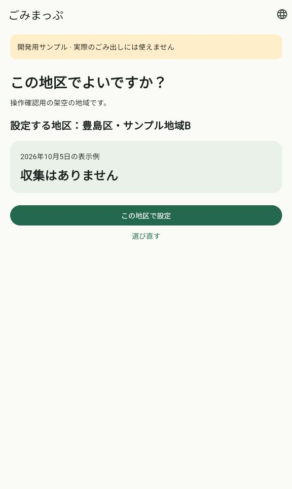
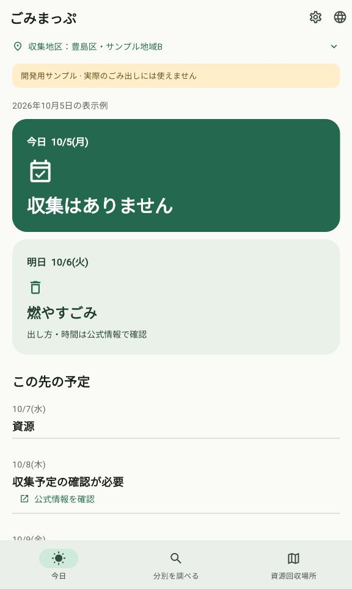
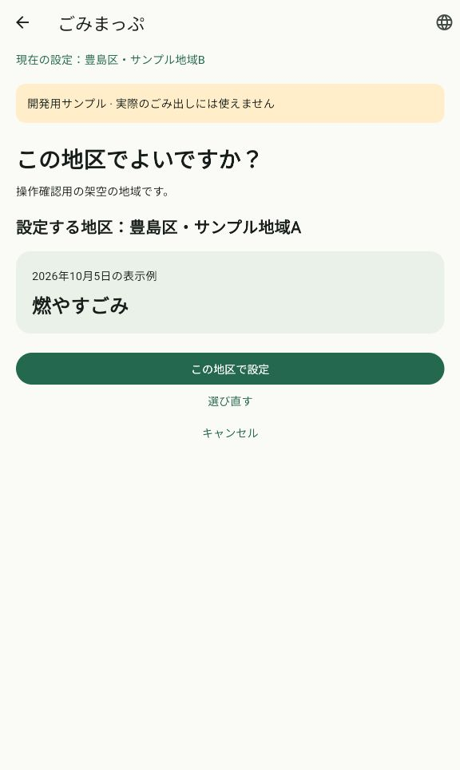

# 初回の地区確認と保存復旧

日付：2026-10-06。関連：[Issue #20](https://github.com/oukiito/gomimap/issues/20)、継続作業：[G05／#5](https://github.com/oukiito/gomimap/issues/5)・[G07／#7](https://github.com/oukiito/gomimap/issues/7)。自作変更はGPL-3.0-or-later。新しい依存ライブラリ・サービスは追加していない。

## 変更した動作

未設定なのにサンプル地区Aの予定を表示していた初期値を除去。初回は地区選択→候補と予定例の確認→保存→今日へ進む。候補を選んだだけでは通常の日程へ入らない。確認前に終了した場合は同じ候補を再開し、保存後の再起動では今日へ直接進む。

後からの変更も同じ確認画面を使う。旧地区を画面上部に固定し、新候補と区別する。保存成功まで旧地区を保持し、取消では元のタブ・検索語へ戻る。保存中は重複操作・戻るを止め、失敗はスクロール外の読み上げ対応の表示から再試行できる。選択／確認の段階を変えると画面の上端へ戻り、全言語で文字を拡大しても操作できる。

地区と進行状態は1つのJSONへ保存。有効な旧設定を引き継ぐが、不正な新形式を旧設定や地区Aへ置き換えない。保存ライブラリが処理完了前にキャッシュを更新するため、失敗時はキャッシュを再読み込みし、確認済みの状態を保持する。

利用者の追加依頼に従い、ルートへ[AGENTS.md](../../AGENTS.md)を作成。利用者優先、全UI・操作・遷移の理由、意味のない文言の禁止、ライセンス・秘密情報、専用GitHubアカウント、Issue／PR、RTKと検証を共通ルールにした。汎用文書へ個人PCの絶対パスを入れず、一般開発者向けコマンドとエージェントの実行規則を区別した。

## UIの根拠

対象はP1・P2。UX05・09・10、S01・02・04・11・12、T01・03・04・09のうち試作の地区確認・保存を実装。[初回設定の設計図](../ux-initial-setup.md)B22〜33に今回の全要素・操作の理由と確認方法を追加した。

GPS・住所解決がないため、この画面には「サンプル」と明記する。実地区を照合できないまま位置許可だけを求めたり、未実装のウィジェットの追加ボタンを置いたりしない。サンプルの初回操作を実地区の設定完了と扱わない。

## 実施した確認

| 確認 | 結果・範囲 |
| --- | --- |
| Dart整形・Flutter静的解析 | 成功 |
| Flutterテスト | 全64件成功。初回・途中再起動・変更取消・保存失敗と再試行・遅延／二重操作・旧設定移行・破損／未知形式・十言語の200%文字・固定した旧地区と失敗理由を含む |
| Webビルド | 成功 |
| Webの実操作 | 新しいローカルオリジンで初回選択・確認、確認途中の再起動、保存後の再起動、別候補の取消で旧地区Bを保持する動作を確認 |
| 文書の読者確認 | 会話履歴を渡さない別エージェントで実装範囲、候補／保存／取消／再起動、`districtSaved`の意味、AGENTSの実行方針を確認。一般向けコマンド例とRTKの適用対象、認証例の環境トークン除外の指摘を修正し、再確認で解消 |
| 文書リンク・公開対象 | ローカルリンク・個人の絶対パス・差分の空白を確認。最終の件数とCI結果はPRへ記録 |

ブラウザ確認はネイティブOSの動作や利用者観察の代替ではない。保存テストの故障はテストアダプターで発生させており、実端末のストレージ故障の再現ではない。

## 画面証跡

| 初回選択 | 保存前の確認 |
| --- | --- |
|  |  |

| 保存後の今日 | 後からの変更 |
| --- | --- |
|  |  |

## 継続する作業

実住所／GPSによる収集区域の解決、例外住所と公開可能な公式データ、通知予約・初回の任意説明、両OSのウィジェット本体・初回の追加／スキップは未実装。`districtSaved`は地区確認済みだけを意味し、将来の任意手順の完了フラグではない。実装時は初回手順の進行・回答とOSの実際の配置を別に保存する。

iOS／Androidのビルド・実機での保存や戻る、各言語話者による内容確認、P1・P2の利用者観察は未実施。アプリは引き続き架空データの開発用試作で、ストアへの登録・一般公開は行っていない。
