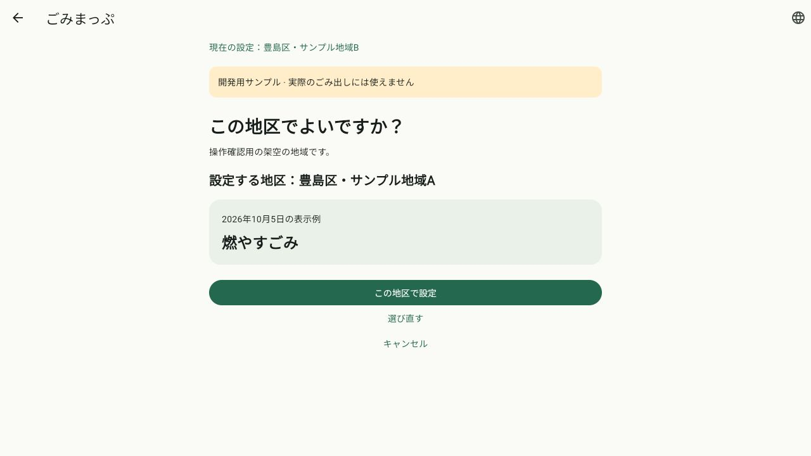
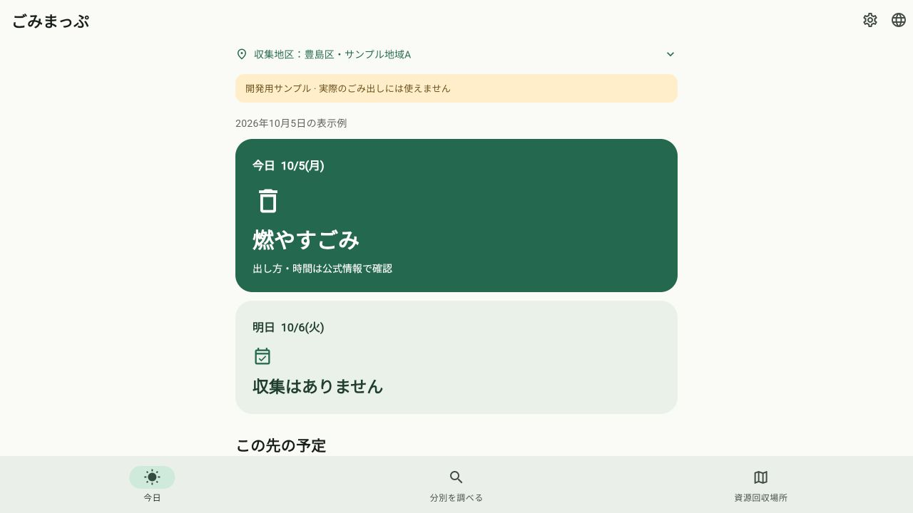

# 自治体データ基盤とCloudflare・端末の保存設計

日付：2026-10-07（Asia/Tokyo）。関連：[G04／Issue #4](https://github.com/oukiito/gomimap/issues/4)。継続：実地区設定#5、通知#6、ウィジェット#7、分別#8、地図#9、取得・公開#10、端末更新・統合#11、再利用条件#14。

## 実装した内容

自治体ごとに1つの版付きJSONを読み、区域・区分・日程・施設・回収窓口・品目条件・根拠・有効期間を保持する[スキーマ1](../data-schema-v1.md)を実装した。自作の架空fixtureは`data/datasets/fixtures/toshima-demo-v1.json`の1か所へ保存し、指定ファイルだけをビルド用の同梱アセットへコピーする。正本は17,670 bytesで、生成物と同じ内容であることを確認した。

住所の町丁目・番地範囲・通り沿いを型付き条件で評価し、複数一致・未回答・根拠不足を区別する。日程は月内の曜日の出現回数、カテゴリごとの取消・追加・年跨ぎ振替・未確認を扱い、空の日程と必要なデータの欠落を分ける。有効期間は開始を含み終了を含まない。

受入判定は、公開拠点と家庭用集積所、通常品目と地図対象を分離。寸法・電池状態・休止・受付時間・根拠等が不足するサービスを推奨しない。閉まっていることと受入条件が合わないことは別に判定し、後日の訪問候補を残す。

日程の共有出力には自治体・区域・版・日付・全区分・締切・根拠・不明理由・fixtureの印を保持する。今日と地区確認プレビューは同じJSONから判定するよう接続した。不正／他自治体／別の版の更新候補は検証前の確定データを変更せず、同じ版の内容差し替えや黙った旧版への戻しを拒否する。これはメモリ内の検証・切り替えで、端末の更新保存・HTTP取得ではない。

公開用CLIは出典登録簿の自治体・登録ID・URL・ライセンス・再配布状態との宣言の一致を確認する。原文の意味・法的許可・人の承認を自動証明しない。自作部分はGPL-3.0-or-laterで、新しい依存は追加していない。

## 保存先の方針

利用者のCloudflare利用希望を受け、[GitHubで承認・履歴、Cloudflareで配信、端末で有効なデータを利用](../data-storage.md)する併用案を記録した。R2 Standard＋独自ドメインを第一候補とし、原文の非公開領域と公開JSONを分離する。R2の料金・JSONの明示キャッシュ設定を公式資料で確認した。Cloudflareの契約・公開設定・配信ジョブは行っていない。

## UIの理由

P1・P2、UX02・05・09、S02・S04、T04・09を参照。[初回設計B34〜37](../ux-initial-setup.md)へ、同じ版からの予定、欠落時の確認表示、原文名の保持、保存後の遷移を追記した。既存のカードと操作を維持し、データ版や検証処理を普通の利用者の画面へ宣伝として加えていない。

画面確認で、保存後の遷移中に選択画面が一瞬表示される点を発見。保存成功時は確認内容と処理中状態を保持して戻るよう修正し、アニメーション途中と二重保存の回帰テストを追加した。

## 確認結果

| 確認 | 結果 |
| --- | --- |
| Dart整形・Flutter静的解析 | 成功。`lib test tool`を対象 |
| Flutterテスト | 全115件成功。スキーマ・参照・期間・不明・地域境界・受入・版更新・十言語200%文字・既存UI・保存復旧を含む |
| 日本以外の端末時刻 | `TZ=America/Los_Angeles`でも日程・ホームの29件が成功。UTC瞬間／外国の時差表記と日本の午前0時を検証 |
| 公開用CLI | fixtureの明示許可で成功。登録簿とのURL・条件・ライセンスの不一致は単体テストで拒否を確認 |
| 同梱データ | canonical fixtureと生成アセットのバイト一致を確認 |
| 出典登録簿 | 14件のメタデータが検査成功。うち12件は引き続き再配布未承認 |
| Web | 最終ビルド成功。地区BからAの予定例・保存後の今日がJSONと一致することを実操作で確認 |
| 文書読者 | 履歴を渡さない別エージェントで保存場所・実装境界・不明状態・公開検査・準備手順を確認。概念名とAPI状態名の対応を追記 |

テストで使う不正な更新・登録簿・住所・受入条件は自作の架空ケース。実際の自治体のルール・法的許諾・施設座標や受付可否を正しいと確認した結果ではない。GitHub CIの結果は関連PRへ記録する。

## 画面証跡

## 後続の作業

実住所・GPSの照合と入力画面、受入サービスの地図接続、実データの利用条件・原文照合、Cloudflareの配信・取得・監視、チェックサム・manifest・端末DB／更新保存・明示的なロールバック、通知・両OSのネイティブウィジェットが未実装。iOS／Androidのビルド・実機試験、利用者観察・翻訳話者確認も未実施。ストア公開の変更はない。
