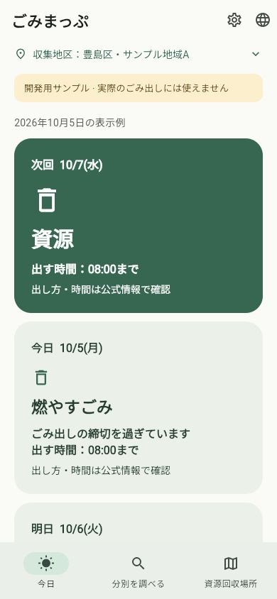

# Androidウィジェットの実装

関連：[Issue #7](https://github.com/oukiito/gomimap/issues/7)。自作fixtureでAndroidホーム画面ウィジェット・共有・初回追加／スキップ・設定からの再追加を実装。[設計 W01〜W17](../ux-android-widget.md)、UX02・10、S14、B13〜20に対応。iOSは未実装。

## 実装

- 同じ日程判定から35日分・10言語・地区・版と区分別締切による時間帯を投影。原子的に保存し、日本の現在日時で選ぶ。schemaVersionは2。
- 締切前は今日の未締切区分、全て締切後は次の収集／未確定日を主表示。今日が不明なら時間で終わったと推測しない。先の未確定日も飛ばさない。回収済みとは断定しない。
- 2×2から縦横に変更可能。小型は次々回を省き、日付・地区・種類・締切を優先。長い訳や文字拡大は本文をスクロールして読める。
- 本体にも締切後の次回主表示を実装し、締切を過ぎた今日の区分は補助表示。区分別締切・日本0時・前面復帰で再評価。検索中の用件を勝手に今日へ切り替えない。
- 初回回答はOS配置状態と分離。スキップ・回答後は通常起動で再提案しない。既存の地区保存済み試作は設定から追加。新規の未回答保存が失敗したら地区保存へ進めない。
- タップで本体の今日へ。地区・言語・データ・前面復帰で共有を更新し、締切／0時の通常アラーム・OS定期／日付等イベントで再表示する。正確なアラーム権限は使わず、OSによる遅延は残る。
- 実画面で不明日の公式確認ボタンが背景に埋もれていたため、濃緑カード内は白い文字・48px以上の操作領域にした。
- 外部Dart／Maven依存は追加していない。ライセンス棚卸しは86件のまま。自作コード・XML・文書・翻訳はGPL-3.0-or-later。

## 確認の現在地

| 対象 | 確認した事実・限界 |
| --- | --- |
| Dart | 179件成功、実通信専用1件は既定でスキップ。未回答・保存失敗・全言語200%・締切直前／ちょうど／経過・別締切・不明・期間外・前面での締切／0時タイマーを含む |
| 解析・Web | 解析の指摘なし。通常Webと固定時刻の画面確認用ビルドで確認。未実装のWeb／iOS追加機能は出さない |
| Android | profile APKとAndroid SDK標準の試験APKをビルド。追加の試験SDKなし |
| Pixelの以前の版 | OS配置の実IDとRemoteViewsを確認。26項目のSDK試験PASS。本人が2×2程度への縮小・オフライン表示・タップで今日へ移動を報告 |
| 最終の締切切替版 | SDK試験に締切・未来の不明・別締切・更新予約・破損時間帯を追加して40項目とした。ビルド成功。USB端末が見えなくなったため、最終の実機実行・インストールは未確認 |
| 正規共有の以前の版 | 実際のアプリがschema1／地区a／toshima-demo-v1、2026-10-08〜11-12、10言語のファイルを保存したことを確認。今回のschema2を実アプリから保存したとはまだ扱わない |
| Webの画面 | 390×844で締切後の次回・日付・区分・締切と今日の補助表示を確認。試験用エントリで2026-10-05 10:00を明示注入し、端末時計は変更していない |

上の画像はWebの表示試験で、ネイティブのランチャー画像ではない。試験用エントリは無視対象の`.dart_tool/`へ置き、通常アプリへ固定時刻を入れていない。実際の締切・0時経過、省電力中の更新到達、他のランチャー・端末、iOS、各言語話者による翻訳は未確認。端末識別子・生ログ・秘密・APKを公開しない。同じ開発AIの実装・SDK確認と、本人のOS操作／画面報告を区別する。
