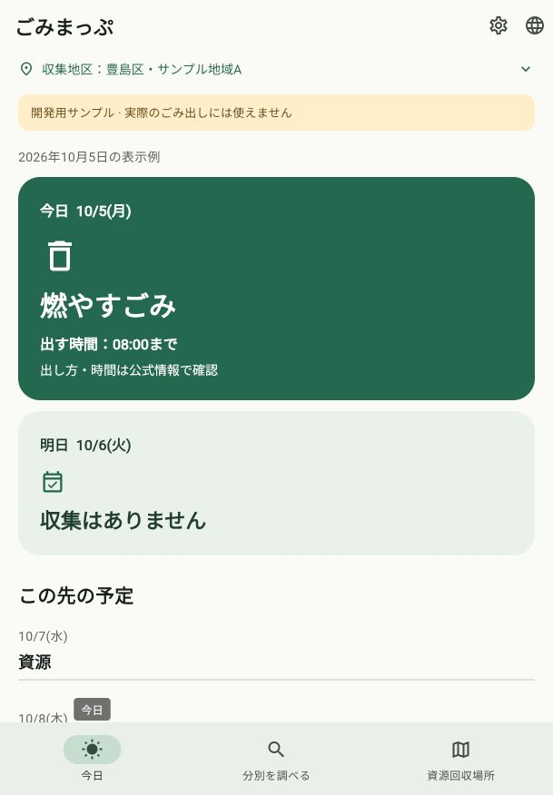

# 開発用データの取得・端末保存

日付：2026-10-08。関連：[Issue #33](https://github.com/oukiito/gomimap/issues/33)、G05／G11。[Cloudflare初回配信](2026-10-08-cloudflare-data.md)の次の実装。対象は自作の架空fixtureのみで、実際のごみ出しには使用できない。

## 変更後の動作

- 初期表示にはHTTPを待たず、検証済みの保存レコード／直前の版／同梱を使う。全て無効なら日程は確認必要。
- 表示後・前面復帰に固定HTTPSのmanifestを確認。成功した確認は24時間、失敗は同一プロセス内で1時間の間隔。同時更新は一つにまとめる。
- 本文のサイズ・SHA-256・スキーマ・自治体・版・有効期間・参照を確認し、保存成功後だけ一括反映。同じ版の改変・暗黙の降版は拒否。期限外を収集なしとしない。
- ネイティブはApplication Supportの専用ファイルへflush・renameし、直前の異なる版を保持。Web確認版は再読込で一致確認するブラウザーキャッシュ。途中ファイルは採用しない。
- 更新で地区・言語・タブ・検索入力を変えない。新しい見出し・宣伝・成功メッセージ・更新用画面は追加しない。[設計理由 D01〜D06](../ux-data-refresh.md)を記録。

## 検証結果

| 確認 | 実施と結果 | 限界 |
| --- | --- | --- |
| Dart整形・Flutter解析 | 標準整形、解析の指摘なし | 実機のOS動作ではない |
| 通常Flutterテスト | 152件成功。実通信専用1件は既定でスキップ | HTTPモック、メモリー保存、実ローカルファイル、設定モック、画面試験を区別 |
| 取得・保存の回帰 | 31件追加。サイズ／checksum／period／自治体／schema／参照／転送／HTTP／timeout／保存失敗／途中ファイル／旧版保持／期限外／再起動復帰／状態保持等 | 強制終了・電源断・ストレージ実OSの耐久性は未検証 |
| 実HTTPS・保存 | 明示的な実通信試験1件成功。実Cloudflare manifestと17,670 bytesのfixtureを認証なしで取得・検証し、一時ディレクトリへ保存。新しいrepositoryが保存を読み、HTTPを再取得せず復帰 | 開発マシンのFlutter試験。端末のpath_providerによる実保存先は未試験 |
| Webビルド | 成功、Wasmのdry runも成功 | iOS／Androidビルドではない |
| 実Web画面 | 既存プレビューを再読込し、地区A・今日の区分／08:00締切・明日・確認必要日を確認。分別へ移り「電池」で乾電池／充電池が表示され、今日へ戻れた | 同梱と公開fixtureは同じ内容。画面だけではブラウザーの実HTTP取得・保存成功を識別できず、その成功の証拠とはしない |
| 依存 | 既存のhttp／crypto／path_providerを同じ解決版で直接利用。86パッケージの本文・版・SHA-256は同じ、lockfile SHA更新 | 完成バイナリ・ストア配布監査は未完了 |
| 公開物 | 文書リンク353件と個人の絶対パスなしを確認。ステージした公開物にローカルCloudflareトークン・アカウントIDが含まれないことを値を表示せず検査、差分の空白検査も成功 | 他の秘密情報の不存在を形式的に証明するものではない |

実WebはCodex in-app browser、609×876、通常文字サイズで確認。同一の開発AIによる実装・確認で、独立した人のレビュー・利用者試験ではない。文字拡大・既存全言語は通常の画面回帰テストを継続した。

## 残る作業

実自治体の再利用許諾・人の原文照合、実地区への初期設定、地図・受入情報へのデータ接続、端末DBの必要性判断、両OSでの通信／再起動／保存失敗／強制終了試験、通知・ウィジェットとの同じ版の共有、継続配信・OSバックグラウンド更新・署名／明示的ロールバック。Webキャッシュの消去・ブラウザー容量と、アプリ全体のオフライン配布も別作業。

SHA-256は取得バイトの一致・破損検知であり、発行者の電子署名ではない。データ本体のAPIキー・自宅住所・GPS送信は行わず、通常のHTTPSアクセスのIP等は配信元へ届く。ファイルrenameは完了候補の切替えで、電源断時の全状態保存・複数プロセス書込みまで保証しない。
