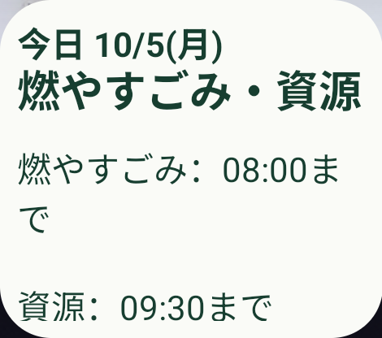
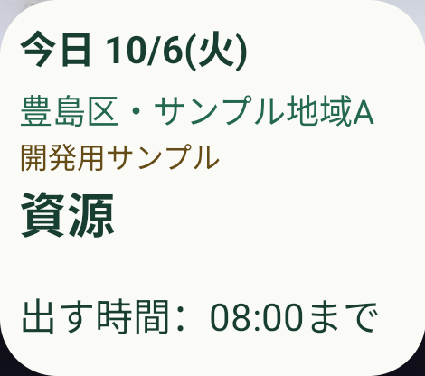

# Androidの隔離QA時計と締切・0時の実画面検証

2026-10-09。[Issue #47](https://github.com/oukiito/gomimap/issues/47)、[手順・QT01〜04](../qa-clock.md)、V01／V02、W13〜16。本体とAndroidウィジェットに共通の固定時刻を渡すQAを実装し、9ケースを実際の画面で検証した。

## 対象と実装

専用API37／arm64エミュレータ、通常文字、日本語、2×2の別QAウィジェット、Flutter 3.47.6／Dart 3.13.5、profile。通常版とQA版は別application IDで、両方の設定・配置を保持した。個人PixelやOS時計・通信・全体の文字設定を変更していない。

Dart定義でQAのIDとKotlinソースを選び、通常版には引数パーサー・QAチャネルを含めない。QAの固定時刻・scenario・revisionを1値で保存し、本体のカード・共有投影・ネイティブの時間帯選択へ反映する。QAは実時間タイマー／RTCアラームを使わず、明示的な進行で更新する。本体の通常タイマーは別のFlutter試験で締切・日本0時の再評価を確認した。

データは所有fixtureから派生したnormal／tomorrow／multiの別版。原本・公式データ・通常版のHTTP取得を変更していない。現在のQA値と通常の実時計は別に読み、古いrevisionや未知・範囲外・別packageを拒否する。

## 実際の画面と判定

最終QA APKをインストール後に下表の全ケースを再実行した。時計の入力はUTC、表は日本時間。共通投影からの期待値に加え、手書きのclock-cases.jsonの日付・区分を独立したoracleとして一致させた。

| ケース | 注入時刻 | 主表示（本体・ウィジェット共通） | 画像 | 実行ID |
| --- | --- | --- | --- | --- |
| before | 2026-10-05 07:59:59.999 JST | 今日 10/5(月)・燃やすごみ | [PNG](screenshots/2026-10-09-clock-before-A02-widget.png) | `20261009T025607766705Z` |
| at | 2026-10-05 08:00:00.000 JST | 明日 10/6(火)・資源 | [PNG](screenshots/2026-10-09-clock-at-A02-widget.png) | `20261009T025616922183Z` |
| midnight | 2026-10-06 00:00:00.000 JST | 今日 10/6(火)・資源 | [PNG](screenshots/2026-10-09-clock-midnight-A02-widget.png) | `20261009T025626791309Z` |
| multi-before | 2026-10-05 07:59:59.999 JST | 今日 10/5(月)・燃やすごみ・資源 | [PNG](screenshots/2026-10-09-clock-multi-before-A02-widget.png) | `20261009T025638249408Z` |
| multi-partial | 2026-10-05 08:00:00.000 JST | 今日 10/5(月)・資源 | [PNG](screenshots/2026-10-09-clock-multi-partial-A02-widget.png) | `20261009T025649826805Z` |
| multi-after | 2026-10-05 09:30:00.000 JST | 明日 10/6(火)・資源 | [PNG](screenshots/2026-10-09-clock-multi-after-A02-widget.png) | `20261009T025659052805Z` |
| unknown | 2026-10-08 23:00:00.000 JST | 今日 10/8(木)・収集予定の確認が必要 | [PNG](screenshots/2026-10-09-clock-unknown-A02-widget.png) | `20261009T025709308681Z` |
| next | 2026-10-05 08:00:00.000 JST | 次回 10/7(水)・資源 | [PNG](screenshots/2026-10-09-clock-next-A02-widget.png) | `20261009T025719379135Z` |
| expired | 2027-03-01 10:00:00.000 JST | 今日 3/1(月)・収集予定の確認が必要 | [PNG](screenshots/2026-10-09-clock-expired-A02-widget.png) | `20261009T025731280423Z` |

全てMaestro MCPのrunがsuccess。各ケースで本体とウィジェットの日付・地区・種類、存在する締切、ウィジェットの日付タップによる復帰をassertし、操作後に画面要素を再取得した。親Flowの返値のコマンド数を内側全操作の数として扱わない。

複数締切は初期位置とスワイプ後を撮影し、二つの時刻をassertした。スクロールによって地区・サンプル表示が上へ隠れる場合があるため、初期位置のPNGも残す。全文がアクセシビリティにあるだけでは読める証拠にしない。

| 締切1ms前 | 締切ちょうど | 翌日0時 |
| --- | --- | --- |
|  |  |  |

PNGはMCPで対象ウィジェットへ直接cropして得たものを、加工せず公開用へコピーした。本体カード・復帰PNGと生結果はGit対象外の.toolingへ保存。最終9ケースの結果・期待値は.tooling/qa-clock/final-results.jsonに記録した。

## 通常版とビルドの確認

- 通常版へ同じQA起動引数を渡しても、本体とウィジェットは実日付に対応する「次回10/12(月)・燃やすごみ」を表示し、通常Smokeが成功した。実行IDは20261009T030227870053Z。
- 通常APKのDEXにはgomimap.qa.clock_msとQAチャネルの文字列がなく、QA APKには制御があることを確認した。
- 明示的assembleReleaseと、releaseを含む汎用assembleのdry-runが、QA定義では想定したnot a release targetの理由で拒否された。これは失敗を合格に読み替えたものではなく、意図したビルド拒否の確認。
- Flutter190件成功、実通信用1件は既定skip。時計の更新・古い応答・入力拒否・元fixture不変・カード／投影更新・通常タイマーを含む。
- 通常版とQA版のSDKはそれぞれ54項目がPASS。通常はliveClockMillis=1791514325496／次回10/12(月)／toshima-demo-v1、QAは1791154800000／次回10/7(水)／toshima-clock-qa-normal-v1を出力した。このSDK計測は9ケースの各GUI計測とは別。
- format・analyze・Web・通常／QA profile APK・通常／QA試験APKのビルドが成功。新しい依存は追加していない。

| GUI試験対象のAPK | SHA-256 |
| --- | --- |
| 最終QA profile | `227f785775b2319be384adb861fd4d2a92c9ac2281d24517e27e06e98193a88a` |
| 通常profile | `9c4e42b6f05b85d5937be1e14cb7256ad76075c98287172e344759f9a8cbf186` |

APK・署名鍵・全体画面・端末IDは公開していない。ソースは本PRの差分に対応する。先行QAビルドの試行と最終ビルドでの9ケースを分け、表は最終ビルドの結果だけを記載した。

## 残る条件

V01／V02のAndroid固定時刻での条件・実描画を部分完了。通常アラームの厳密な到達、Doze、全言語・最大文字・追加取消／再追加、iOS、実データ、通知、利用者観察、UI用CIはこの結果に含めない。SDK／AIの画面評価を人の承認と扱わず、#3・#7を継続する。
