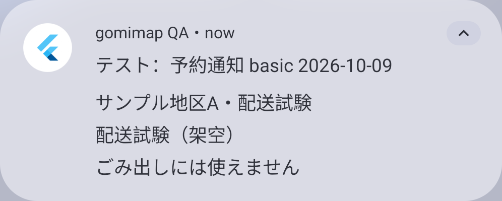
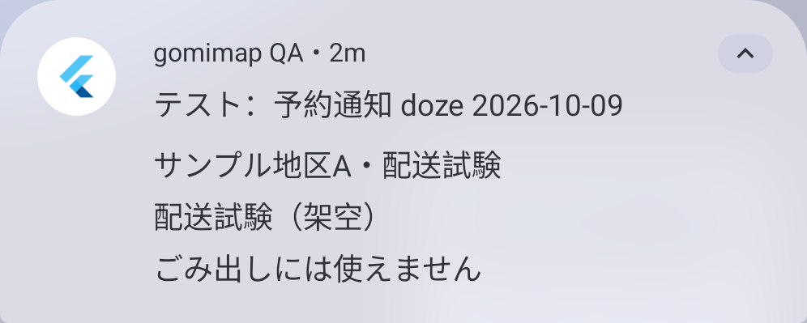

# Android通知の実配送・再起動・Dozeの記録

2026-10-09。[Issue #51](https://github.com/oukiito/gomimap/issues/51)、#6の部分対応。V04、NT13／QT05、[再実行手順](../android-notification-delivery.md)。予約と手動通知とは別に、AlarmManagerから実際にReceiverが動いてOSへ投稿することを確認した。

## 対象・隔離・実装

専用API37／arm64エミュレータ、Flutter3.47.6／Dart3.13.5、profile。別QA ID、実時計、日本語、サンプルA。通常版・個人Pixelの時計・通知・通信・アプリデータは変更していない。新しいpub／Maven／Python配布依存も追加していない。

SDK-onlyの短期試験planを準備し、Instrumentationはすぐ終了する。待機中にQA本体を起動せず、最初のケースでは予約時刻付近にpidofが空であることも確認した。UIの希望設定・日程生成を経由する試験ではなく、ネイティブの短い実予約を注入する試験である。通常の朝6時・実際の分別の正確性をこの結果で証明しない。

QAだけがReceiverの起動と、notify後の自作activeNotificationsのpostTime・ID・世代・idleを端末へ記録する。手動投稿ID39000と自動投稿ID30001を分け、reportは対象caseのdue・期限・自動ID・OS時刻が一致した結果だけを配送として集計する。本文・端末ID・位置・写真・外部送信は含めない。

通常版の通知計測はno-op。通常profileのDEXにQA記録パス・実時計切替引数・試験runnerが含まれないことを確認した。試験runnerはQA package／emulator hardwareを検査し、host CLIもemulator形式／qemu=1／QAの存在を確認する。

## 配送結果（日本時間）

OS postTimeと、post後の計測時刻は数ms違うので、下表の遅延はOS postTimeから算出した。世代は端末の予約世代で、SDK試験の項目数ではない。

| ケース | 予約時刻 | OS投稿または抑止 | 確認・証拠 |
| --- | --- | --- | --- |
| 短い実予約 | 16:40:59.943 | 16:41:16.195、16.252秒遅延 | Receiver→posted、ID30001、世代52。[結果JSON](evidence/2026-10-09-notification-basic.json)、[OSカード](screenshots/2026-10-09-notification-delivery-basic.png) |
| 再起動 | 16:45:28.204 | 16:47:30.727、122.523秒遅延 | 16:42:44.766にBOOT_COMPLETED、同世代54の配送。起動後経過時間も再起動を示す。[結果JSON](evidence/2026-10-09-notification-reboot.json) |
| 強制Doze | 16:51:37.941 | 16:52:11.870、33.929秒遅延 | Receiver／postedの両方でidle=true。画面操作なしで観察し、撮影前に強制状態を解除。[結果JSON](evidence/2026-10-09-notification-doze.json)、[OSカード](screenshots/2026-10-09-notification-delivery-doze.png) |
| 期限切れ | 16:56:48.773、失効は1ms後 | 16:57:22.706にReceiver、postedなし | 遅延で失効した通知を出さない。処理が起動しなかったことと区別。[結果JSON](evidence/2026-10-09-notification-expiry.json) |
| 取消 | 17:00:20.973 | 17:01:56.929時点までReceiver／postedなし | 準備時に所有予約1件→取消→0件をnative assert。約96秒の締切後観測で、永続的な不在の証明ではない。[結果JSON](evidence/2026-10-09-notification-cancel.json) |

PNGはMaestro MCPで自作通知カードに直接cropし、加工せずコピーした。基本ケースはデスクトップ接続、Dozeカードは新しいstdio MCP接続を使った。再起動後の既存desktop driverがUNAVAILABLEとなり、その時点のGUI取得は失敗した。新しい接続のlist_devices→inspect_screen→runで復旧できたため、再利用可能なcapture CLIへ追加した。再起動の最初の成功はJSONのみで、未取得画像を取得済みとしない。

## 試験入口の修正と回帰確認

初期実装で追加Instrumentationを別登録したところ、pm list instrumentationに既存WidgetChecksが現れず、SDK試験の呼出しが失敗した。この状態のまま完了にせず、既存WidgetChecksのdeliveryActionへ短期試験を統合した。通常のSDK試験と配送試験を同じ入口の別モードで実行する。

- Flutter215件成功、実HTTP用1件は既定skip。format・analyze・Webが成功。
- Python52件成功。新規9件で個人端末／偽のemulator ID拒否、qemu／QA確認、caseとrebootの一致、Doze解除、復旧失敗、manual／別ID／期限外の除外、自作カードのapp名とタイトルが同じ行にあることを確認。
- 通常／QA profileと両試験APKをビルドした。通常／QAのSDK既存62項目がそれぞれ統合後もPASS。通常へのdeliveryActionはQA package requiredで拒否された。
- 通常版への短期試験はQA package requiredで拒否された。これは意図した保護の確認で、通常のSDK試験の失敗とは分ける。

| GUI／配送の本体APK | SHA-256 |
| --- | --- |
| QA profile | 114276a68ae06dac13438cf12e226df04e7661e7d1a4a3384a8d6cd66e75d258 |
| 通常profile | f5599437a3f138d83c0f2db2db89ff785ad8fe2f306213314781d79e3170f200 |
| 統合後QA試験APK（再起動） | a768f5d3864939d3e1789b011101a2dff8a595b5d211b61145b48356ac7d437a |
| 最終QA試験APK（channel名保持） | 7a520decbba77886e0abb46a2769ab6a6b640b608e45fff5a38bbc1492408a94 |

基本・最初の再起動・Doze・期限／取消は先行の別runnerで、統合後の試験と区別する。本体の配送コードは同じQA profile。統合後のrunnerで90秒先の再起動ケースを再実行し、17:04:39.145にBOOT_COMPLETED、17:05:53.345の予約へ17:06:47.479にOS投稿（54.134秒遅延）を確認した。世代62・[結果JSON](evidence/2026-10-09-notification-reboot-final.json)。新しいcapture CLIで[自作カードPNG](screenshots/2026-10-09-notification-delivery-reboot.png)の取得・assertが成功した。

## 利用者への含意と残る確認

今回の短期試験でも通知に数十秒〜約2分の遅延があった。設定時刻を正確な到達保証と扱わず、朝6時の候補で締切まで余裕を持つ。不正確アラームにはOSの時間窓や省電力の制約がある。[Android公式仕様](https://developer.android.com/develop/background-work/services/alarms)、[Dozeの制約](https://developer.android.com/training/monitoring-device-state/doze-standby)。今回のDoze成功を長期滞在や全端末の保証にしない。

最終cleanup後、mForceIdle=false、batteryのUPDATES STOPPEDなし、case markerなし、旧planのentriesが空へ戻ったことを実際に検査した。希望・地区・言語は試験から書き換えていない。希望・地区・言語・ウィジェット配置は削除しない。

Pixel実機、正確な6時／前夜20時、メーカー固有の省電力、強制停止、長期未起動、実自治体データ、iOS、UPの全中断点と人の使いやすさは未完了。#6／#7／#11を継続する。

最終runnerは試験planのchannel名に旧planの名前を引き継ぎ、QAのOS表示名を試験用に置き換えない。17:13:53.440の30秒先予約から17:14:16.137に投稿（22.697秒遅延、世代64）、OS channelに元の日本語名が残ることを確認した。[最終結果JSON](evidence/2026-10-09-notification-basic-final.json)。本体APKは同じ、最終試験APKは上表のchannel名保持版。
