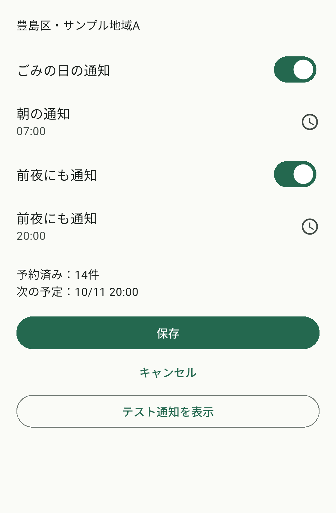
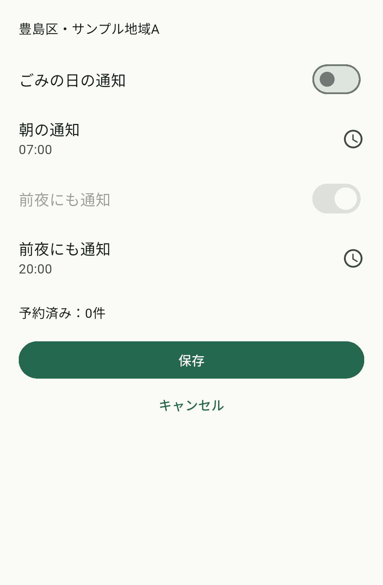

# Android通知の設定・予約・OS表示・タップの試験

2026-10-09。[Issue #49](https://github.com/oukiito/gomimap/issues/49)、#6の部分実装。NT01〜12、S03・S05・S12、T05・T22、RC11、UPの部分対応。指定時刻の配送成功や実データの正確性を証明する記録ではない。

## 実装と対象

共通日程から14日／最大28件の朝・前夜planを生成し、未知・収集なし・過去時刻・全締切後・期間外を除外する。希望設定と初回回答、OS許可、登録結果を分ける。Android標準APIの自作MethodChannelと世代付きjournalで旧予約の停止・新予約・配送時の期限照合を行う。pub／Maven依存は追加していない。

通常版はfixtureの予約を除外する。現在のネイティブ検査も非空planをQA別IDに限定し、製品データの通知は未接続。初回回答を地区保存前に記録し、旧利用者はOFF・回答済みへ移行する。地区／言語の保存前に停止し、確定後と起動・復帰・データ変更で再生成する。通知タップでは対象日詳細を開き、地区や版の変更を照合する。

専用API37／arm64エミュレータ、Flutter3.47.6／Dart3.13.5、profile、日本語／英語、サンプルA。実時計モードの別QA IDを使用した。個人Pixelのデータ・OS時計・通信・全体設定は変更していない。

## 実画面の確認

| 操作 | 実際の結果と証拠 |
| --- | --- |
| ON保存→OS許可拒否 | 明示操作の後にOSダイアログ。希望ONは保存、端末で許可されていない旨を表示。拒否を予約成功にしない |
| 次の保存→OS許可 | OSのAllowを操作して予約7件、次は10/12 06:00 |
| QAのテスト通知 | OSの通知欄に「テスト：今日2026-10-12のごみ」、地区・燃やすごみ・08:00まで。[OSカードPNG](screenshots/2026-10-09-notification-card.png) |
| OSカードをタップ | アプリに2026年10月12日、サンプルA、燃やすごみ・08:00の対象日詳細が開く。今日で現在の画面へ戻る |
| 全通知OFF保存 | 予約7件→0件、テストボタンが消える |
| 前夜もON、日英変更 | 朝06:00／前夜20:00で14件。日本語→英語→日本語でも希望・時刻・件数を維持し、地区も翻訳を更新 |
| 朝の時刻変更 | 24時間のOS風時刻選択を文字入力へ切替、6→7、OK→保存。07:00へ変更・保存されたことを画面で確認 |
| 最終Smoke | ON保存→OS許可→予約14件→OFF保存0件。Maestro Flowが15 commands／success。下のPNGは最終QA buildの画面 |
| 通常版 | fixture通知を予約しない理由、QAテストボタンがないことをassert。[通常版PNG](screenshots/2026-10-09-notification-normal-fixture.png) |

| 予約を確認 | 停止を確認 |
| --- | --- |
|  |  |

PNGはMCPで自作画面／OSの自作通知だけに直接cropし、加工せずコピーした。手動テスト通知のOSカードは先行QA build、ON／OFFは最終QA buildであり、同じAPKの全試験と扱わない。生結果・APKはGit対象外の.toolingに保存した。

再実行Flowは[e2e/maestro/flows/notification-smoke.yaml](../../e2e/maestro/flows/notification-smoke.yaml)。launchAppのall:unsetがQA通知権限を未決定へ戻すため、既存許可を前提にした先行試行はassertで失敗した。実OSダイアログを保存後に操作するFlowへ修正した。通知設定の実装による権限消失ではない。通常版の理由文言を誤って指定したassertも失敗し、画面階層の正確な文言で再試験した。成功と失敗を混同しない。

## 論理・SDK・ビルド

- Flutter全215件成功、実HTTP用1件は既定skip。追加25件はplanの除外／期限／複数締切、設定保存／移行／破損、取消失敗時の保存拒否、保存失敗時の旧plan復旧、反映失敗時の新希望保持、地区変更拒否、初回スキップ／再起動、OS拒否と取消を含む。
- 全10言語で200%文字・390×844論理pxにて通知設定から保存ボタンへスクロールでき、描画例外がないことをFlutter画面テストで確認。実機の読み上げ／言語話者の確認ではない。
- 通常版／QAのネイティブSDK試験はそれぞれ62項目PASS。予約時刻前・締切ちょうど・前夜の翌日・期限・重複ID拒否・不正candidateで旧journalを維持する8項目を追加。通常版は実時計・次回10/12・toshima-demo-v1、QAは別版の実時計。
- format、analyze、Web、通常／QA profile APKが成功。ネイティブ SDKとMaestroの操作試験を区別する。

| 最終UI APK | SHA-256 |
| --- | --- |
| QA profile（ON／OFFのSmoke） | e22a048bc6c2a62cd1002cbd02acd1b3e40b6c34e539cfa2554eaf602e7c49bd |
| 通常profile（fixture理由） | 2e85b3febf5f708513c5384a213eb11d37d4d47bbb4fe56c2769d0424bfe831c |

この後のソース修正では、OS未許可や0件なのに「次の予定」を表示しない条件とその回帰assertを追加した。また通知未対応のWeb／iOSでは起動チャネルを呼ばないguardと回帰試験を追加した。最終UI APKの画像はその条件変更前で、許可済み正数／OFF／fixtureに関する同じ動作を検証したもの。

## 未完了の条件

朝6時／前夜20時に実際に配送されること、Doze・長期未起動・再起動の実配送、各中断点の故障注入、全設定と投影の耐久pending、実自治体データの公開ゲート、Pixelの通知試験、iOSとTalkBack、人の使いやすさは未確認。AlarmManagerの登録とPendingIntentの照合は配送保証ではない。

iOSはXcode本体が未導入。本人がAndroid優先を選択したのでAndroidを先行する。#6はiOS・実データ・到達条件を含めて継続する。Androidの設定／取消／OS表示を部分完了にしただけで製品通知完成とは扱わない。
