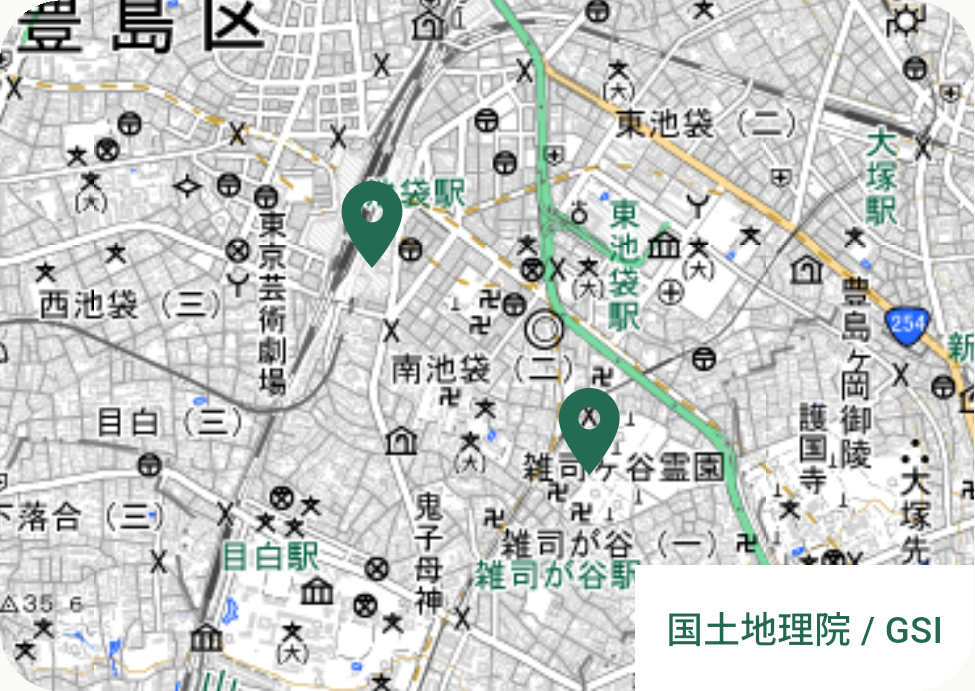
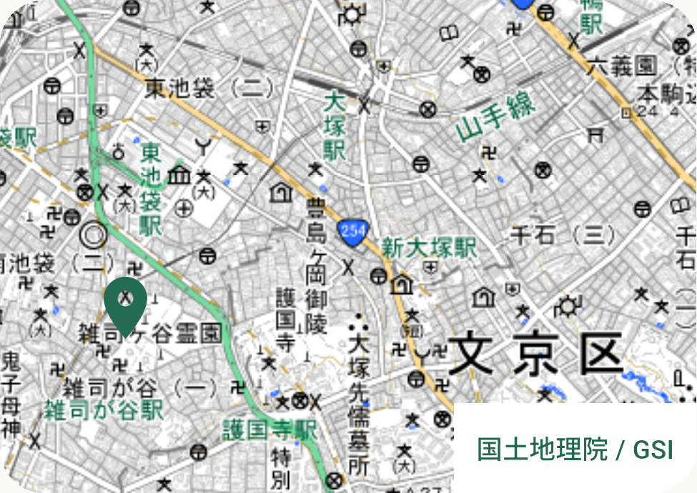

# 国土地理院の資源回収地図と位置保持

2026-10-09。#54、#53の3番の部分実装。RC05／10／13〜16。描画元と使う条件を確認して地図を接続し、架空拠点の動線を実際のタイルで試した。実拠点・受付条件・実日程の提供完了ではない。

## 接続・条件

GSI paleのズーム10〜18をアプリの通常起動へ採用し、出典リンクを地図内へ常時表示する。PDL1.0／GSIのリアルタイム利用条件を[ライセンス記録](../licenses.md)に保存した。新pub／Maven依存・有料契約・APIキーなし。カスタム3項目の上書きとMAP_DISABLEDを用意し、不完全な設定を成功扱いにしない。

ネイティブは既存flutter_mapのHTTPキャッシュ、起動時縮小目標32MiB。実行中に超過しうる。Webはブラウザーのキャッシュ。先読み・一括取得・配布タイルは作らない。位置は現在の画面のメモリにだけ保持する。地図の操作で自宅地区を変更しない。

## 実画面の結果

専用API37／arm64エミュレータ、別QA ID、profile、日本語、通常文字、保存済みサンプルA。PixelのOS設定・データ・時計を変更していない。新しいstdio Maestro MCP接続でlist_devices→inspect_screen→runを実行し、座標操作・直接ADBのキャプチャを使わず観測した。

- 未選択の概観で実タイル・2つの自作ピン・出典が表示された。受入適合の一覧とは扱わない。
- 長い説明を省き、240〜360論理pxの可変地図で、初期画面に地図と出典が収まることを確認した。
- MapCanvasのSemanticsから左へスワイプし、背景・ピンの位置が変わった。
- 今日タブ→資源回収場所へ戻ると、pan後と復帰後のPNGのbytesが一致した。MCP Flowが10 commands／success。

| 概観 | 移動後と復帰後（同一） |
| --- | --- |
|  |  |

PNGはMCPが自作の地図領域へcropしたものを加工せずコピーした。背景は国土地理院『地理院タイル』PDL1.0に自作fixtureピンを重ねた表示。背景をGPLへ変更しない。[GSIタイル一覧](https://maps.gsi.go.jp/development/ichiran.html)、[GSI規約](https://www.gsi.go.jp/kikakuchousei/kikakuchousei40182.html)。

## 検証と修正した試行

Flutter218件PASS＋実HTTP1skip、format・analyze・Web、通常／QA profile buildが成功。追加3件で、認証情報付きURL拒否、pan後の再配置、503のMockClientから再試行／一覧／位置保持を確認。503は意図した模擬失敗で実サービスの異常ではない。全10言語の200%文字・検索・条件・戻るを確認した。

最初のStateful化でpointsのフィールド配置を誤りcompileが失敗したため修正。従来の「Mapなし」assertを、変更後の未選択概観と電池未回答の「持込ピンなし」の契約へ更新した。未接続の意味のない文言を削除した際の古い翻訳assertも変更後の失敗表示へ更新し、全件を再確認した。

| APK | SHA-256 |
| --- | --- |
| GUI対象QA profile | 7e56a3d26fdf265cf2b55e48e22e678d155c5f0ea9232739ff3868f36d766cba |
| 通常profile | f428c92d09d5999dd0977a8b366f952a7c54cbed3d9528cf5bc932ef1cc63d1e |

タイルの実HTTP表示は専用エミュレータ、失敗／再試行と10言語拡大はFlutter試験。iOS／Pixelでの実配信・翻訳話者・全地図読上げ・長期キャッシュ容量は未確認。実データと条件は#14／#8／#9／#53で継続する。
