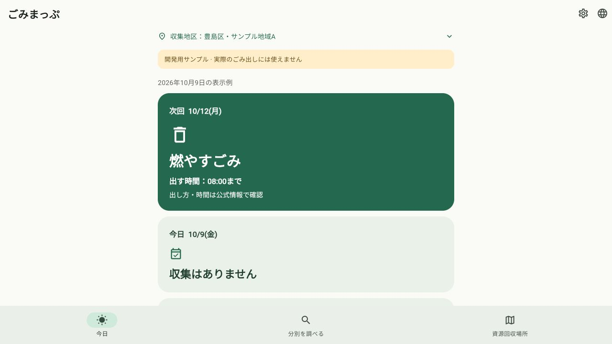

# Maestroの導入・MCP接続・画面試験の準備

関連：[Issue #42](https://github.com/oukiito/gomimap/issues/42)、[方式](../android-ui-test-strategy.md)、[Flow](../../e2e/maestro/README.md)。自作fixtureを対象に準備した。A01〜A03のAndroid画面取得・タップ・復帰はまだ実行していない。

後続：Codexの再起動後、専用エミュレータのA01〜A04を実行した。[実画面の検証記録](2026-10-09-maestro-ui-poc.md)。以下は再起動前の準備時点の結果を保持する。

## 実施したこと

| 対象 | 確認結果 |
| --- | --- |
| CLI | 公式cli-2.11.0のzipをSHA-256照合して`.tooling/`へ配置。`--version`は2.11.0。再実行できるローカル導入スクリプトも確認 |
| MCPサーバー | STDIOのinitialize／tools/listを実行。serverInfoはmaestro／1.0.0で、CLI版とは別。inspect_screen・take_screenshot・run等の一覧を確認。デバイス選択・画像取得・タップは呼んでいない |
| Codexの設定 | プロジェクト専用のGit対象外`.codex/config.toml`へ登録。既存グローバル設定を変更していない。起動は`--no-viewer`で、クラウド操作を公開せずツールの承認を維持 |
| 現在のセッション | 新しいMaestroツールはまだカタログにない。再読み込み後に接続・端末選択・画面操作の許可を確認する必要がある |
| 専用エミュレータ | 既存のAPI37／arm64システムイメージからプロジェクト内に新しいAVDを作成。起動完了を確認し、profile APKをインストール・起動。SDKの40項目がPASS。個人Pixelへはこの作業で操作していない |
| アプリ | 言語・地区・予定・ウィジェット追加に外部試験用IDを追加。種類や出し方の文言・日程を変更せず、既存の読み上げ情報とクリック動作を維持 |
| 判定準備 | 現在時刻のfixture期待値を`.tooling/maestro-results/expectation.json`へ生成するFlutter補助試験が成功。Flowは準備済みで、実行・構文検証の成功は未確認 |
| 検証 | Flutter 182件成功、実通信用1件は既定skip。解析・Web・profileビルド成功。Python 43件成功。期待値出力の補助試験1件も成功。アプリ依存の棚卸し86件は変わらない |

## 試験用IDの理由

| ID／対象 | 場面・理由 | 戻る・保持・失敗・確認 |
| --- | --- | --- |
| QA01 `setup-area-a/b`・`setup-confirm-area` | 翻訳文言が変わっても確認済み地区へ進む操作を再実行する | 既存の保存・取消・失敗制御を使用。試験ID自体は地区を保存しない |
| QA02 `language-menu`・`language-<tag>` | 10言語で同じ言語切替操作を探す | 言語名・tooltip・tapを維持。単一の操作はMergeSemanticsでIDと結びつけ、空の親要素へ操作を分離しない。日英の意味情報・クリック動作とWeb操作を確認 |
| QA03 `schedule-primary`・`schedule-primary-date/description` | 本体の表示対象と期待値を比較し、カードの画像に絞る | 収集判定は同じCalendar。戻るや検索状態に影響しない。異なるラベル・不明状態を検出したら失敗として記録 |
| QA04 `widget-add/skip`・`settings-open/widget` | 初回・再追加を実際の操作から試す | 既存のOS要求／配置の区別、回答保存、スキップを維持。配置をIDの存在だけで成功としない |
| QA05 Android `widget_root` | ホーム画面全体を取得せず、自作ウィジェットに画像を絞る | 見た目・状態・日程を変えない。対象要素の実検出・画像取得はMCP接続後のPoCで確認する |

画面に技術IDを表示しない。複数の操作を含むカードはMergeSemanticsでまとめず、単一ボタンの情報と操作だけを結びつける。日付と種類の独立した意味情報、日本語・英語の読み上げとtap actionを回帰試験で確認した。Webでも言語メニューを開き、日本語選択後の表示を確認した。

画像はWebの確認で、AndroidのMaestro実行証拠ではない。実機のウィジェット表示・追加確認・画像・タップをSDKやWebの成功で代替しない。

## 次に必要なこと

[公式MCP手順](https://docs.maestro.dev/get-started/maestro-mcp)はCodex Desktopの再起動による接続の再読み込みを案内している。設定とサーバーが準備済みでも、現在の会話に操作ツールがないまま実行成功としない。再読み込み後に専用エミュレータを明示し、実際のOS追加画面を調べて配置を確認してからA01〜A03を実行する。

MCPへ接続しただけで実行制約が解除されるとは保証しない。以前拒否された直接キャプチャを別コマンドで迂回していない。今回のMCPプロトコル検証ではメタデータだけを要求した。クラウド送信・追加AI解析は使っていない。
