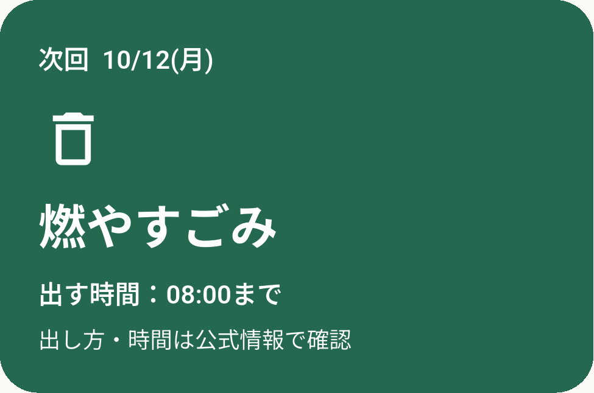
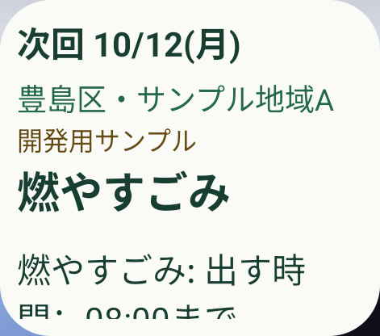
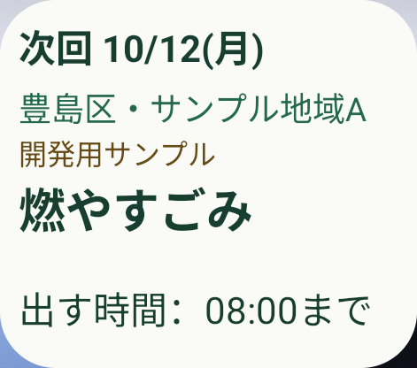
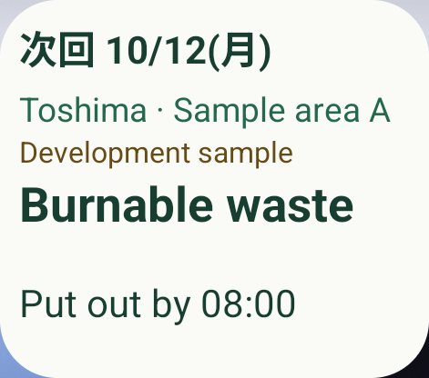
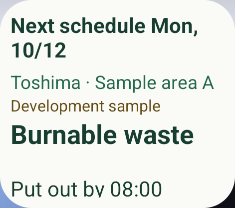

# MaestroによるAndroidの画面取得・操作・ウィジェット検証

関連：[Issue #42](https://github.com/oukiito/gomimap/issues/42)、[準備記録](2026-10-09-maestro-preparation.md)、[実行手順とFlow](../../e2e/maestro/README.md)、[設計 W18〜W20](../ux-android-widget.md)。Codex再起動後、公式Maestro MCPの実画面取得と操作を専用エミュレータで確認した。

## 対象と方法

| 項目 | 今回の条件 |
| --- | --- |
| 環境 | 専用Android API37／arm64、Google APIs Play StoreイメージとPixel系ランチャー。AVD名は`gomimap-ui-api37` |
| 本体 | Flutter 3.47.6／Dart 3.13.5、profile、`0.1.0+1`。準備PR #43の基点に本PRの修正を適用 |
| データ | 自作fixture `toshima-demo-v1`、サンプル地域A。実地区・公式日程ではない |
| 表示 | 2×2の初期配置、通常の文字サイズ、日本語・英語。端末の時計・文字サイズ・ネットワークは変更しない |
| 操作 | Maestro 2.11.0の`list_devices`・`inspect_screen`・`take_screenshot`・`run`。固定ID／実際の文言で操作し、操作後に要素を再取得 |
| 保持 | `clearState: false`・`stopApp: false`。地区・既存配置を保持。権限の`all: deny`は専用エミュレータの試験条件 |
| 画像 | `cropOn`で本体の主カード／自作ウィジェットのみ取得。今回の公開PNGは取得したバイト列をそのまま保存 |

個人Pixelを操作せず、以前拒否されたADB直接キャプチャを再試行していない。新たに提供されたMCPの対象は専用エミュレータに限定した。Maestro Cloud・Maestroの追加AI解析は使用していない。

## 実行したこと

最初の設定は、言語メニューから日本語、サンプル地域A、地区確認で保存、初回のウィジェット追加を順に操作した。実際のOS画面で`Add to home screen`を検出して選択し、ホーム画面に1つ配置されたことを確認した。要求が受理されたことだけで配置成功と判定していない。別ランチャーへこの文言を決め打ちしない。

| 試験 | 実際の判定と結果 |
| --- | --- |
| A01 本体 | 主表示の日付・種類と保存した地区をassert。主カードPNGを取得。成功 |
| A02 ホーム | Homeへ戻り、ウィジェットの日付・地区・種類・締切をassert。ウィジェットPNGを取得。成功 |
| A03 復帰 | ウィジェットの日付をタップし、本体の今日で同じ日付・地区・種類を再assert。復帰後のカードPNGを取得。成功 |
| A04 言語変更 | 固定IDで日本語→英語→日本語を選択し、それぞれA01〜A03を再実行。日付・本文・地区・締切が選択言語で一致。成功 |

期待値は実行直前に`maestro_expectation_test.dart`でfixtureから生成した。本体とネイティブへの投影が同じ値を描画するかの比較であり、自治体の正しい収集日を保証する試験ではない。

最終ビルドで成功した実行（時刻は日本時間）：

| 実行ID（UTC由来） | 時刻・操作 | 確認した主表示 |
| --- | --- | --- |
| `20261008T183603132225Z` | 10/9 03:36、英→日 | 次回10/12(月)、豊島区・サンプル地域A、燃やすごみ、08:00まで |
| `20261008T183644242004Z` | 10/9 03:36、日→英 | Next schedule Mon, 10/12、Toshima · Sample area A、Burnable waste、Put out by 08:00 |
| `20261008T183726643135Z` | 10/9 03:37、英→日へ復元 | 日本語で同じ日付・地区・種類・締切 |

各実行の`run`は`success: true`。`language-widget-smoke.yaml`の中から`widget-smoke.yaml`を実行した。返値のコマンド数は親Flowの数なので、全ての内側の操作数として記載しない。生の結果と画像はGit対象外の`.tooling/maestro-results/`へ保存した。

### 本体とタップ後

主カードの2画像は同じSHA-256だった。地区のassertはカード外の実際の画面要素で確認した。検索語の保持は今回のFlowでは操作していない。

## 見つかった不具合と修正

### 締切の文字切れ

修正前のA01〜A03はassertが成功したが、2×2のPNGでは`燃やすごみ: 出す時間：08:00まで`の後半が切れていた。アクセシビリティ上の全文が存在しても、実際に文字を読める証拠にはならない。

共通の締切は`出す時間：08:00まで`の1行とし、種類は主表示へ残した。複数区分で締切が異なる場合は種類別の時刻を維持する。実測された164dp幅・42dpの見える行領域で文字が収まるSDKの回帰試験と、日英の実際のPNGで確認した。日程やschema2の意味は変更しない。

### 日付だけ旧言語が残る

英語の試験では、本文が英語でも日付だけ日本語になり、日付のassertが失敗した。ネイティブへ新しい言語が保存され、全体更新へ英語の日付を渡していることまで診断した。単なる待機や本体の開き直しでは直らなかった。

描画内容のSHA-256を一覧アダプターURIへ加え、別の一覧変更通知を重ねず、全体の更新からその版の一覧を再読込する。修正後は配置を作り直さず日→英→日で成功した。同じ描画では同じURI、言語・日付が変われば別のURIとなる回帰試験も追加した。Androidの全ランチャーでの同じ挙動を確認したものではない。

初回の提案文も「今日のごみ」から予定の表現へ全対応言語で変更し、日本語のウィジェット名を「ごみの予定」とした。締切後の次回表示と名称の食い違いを避ける。ARBからFlutterとネイティブのラベルを再生成した。

## 回帰・ビルドの確認

- Flutterの既定試験183件成功、実通信用1件は既定skip。共通締切の複数区分と異なる締切の試験、生成したネイティブfixtureとの一致を確認した。
- 現在時刻の期待値出力は日英とも成功。日付／締切を跨ぐ場合は再出力する。
- `dart format`・`flutter analyze`・Webビルド・arm64 profile APKビルドが成功。ネイティブラベルの`--check`が成功。
- SDK標準Instrumentationは45項目＋現在ファイルを使う4項目、合計49項目がPASS。締切切替・不明・期限・言語・行寸法・アダプターURIを確認。`liveDateLabel=次回 10/12(月)`、`liveVersion=toshima-demo-v1`。
- アプリのpub／ネイティブ依存を追加していない。Maestroは準備記録のホスト用構成を使用。

対象APKのSHA-256（APK本体・署名鍵はGit対象外）：

| 成果物 | SHA-256 |
| --- | --- |
| arm64 profile | `1c09e40bc2538d9f853f818e026df3945feb02c83add633e33526d6cfc885ad5` |
| SDK試験APK | `8d8bb86e26342a7b3af536076696db468b97de7a2f6b32a7b9ac64061d1a3031` |

## 残る確認

A05の文字200%・全言語のランチャー描画、A06の本体／ネイティブ共通の試験時計による締切・0時の画面再現、A07の取消・削除後の再追加、Dozeによる更新遅延、Pixel実機のMaestro試験、iOS、UI用CIは未実施。SDKの日付入力の成功と実際の時刻到達の成功を区別する。

これは実際の操作と画像に基づくAIによる検証で、人による利用者観察・翻訳話者の確認・独立した人の承認ではない。公式データの権利確認や一般公開条件も引き続き別作業とする。[Issue #7](https://github.com/oukiito/gomimap/issues/7)はAndroidの残る試験とiOSの作業を含むため、このPoCだけで完了にしない。
