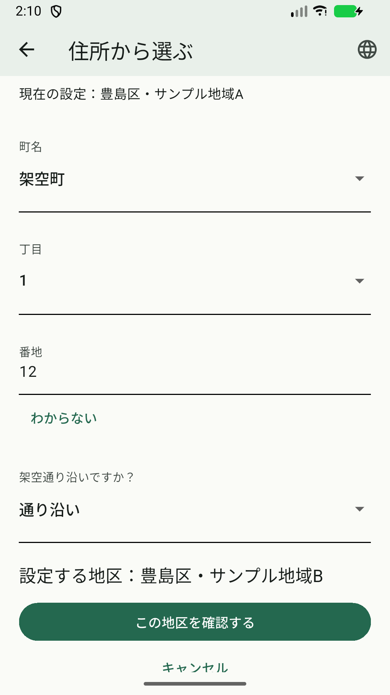

# 住所条件から地区候補を確認するフォーム

2026-10-09着手、2026-10-10検証。[Issue #56](https://github.com/oukiito/gomimap/issues/56)、#53の2番の部分対応。LC05／06／09〜12、S01／02、T03／04。住所の条件から候補を絞り、既存の確認・保存へ進む画面を自作fixtureへ実装した。実住所・GPS・実区域の接続完了ではない。

## 実装・理由

質問と選択肢はdatasetのaddressSelectorsと根拠・期間から生成する。入力に既定値を入れず、必要な項目を順に表示する。上位の変更で下位回答を解除し、分からない／範囲外／複数候補／期限外を確定にしない。番地の全角・ネパール等の数字を正規化し、句読点・小数・過大入力を数値にしない。

地区が一つに絞れた後も、保存済み地区は固定表示し、新しい候補は既存の日付付き予定例・確認画面へ渡す。データ版／期間／根拠を再確認してから候補を適用する。取消は旧地区、保存失敗は既存の復旧を使う。住所の回答はフォームのメモリだけに持ち、地区の設定には保存しない。

利用者指定の「ミニマル・見やすい・過度なデザインを追加しない」をAGENTS／UI設計／決定に反映した。標準の下線入力、48px以上の操作領域、必要な情報だけを使う。文字を小さくして密度を上げない。現在の地区／自治体を上部へ固定し、重複した自治体名・装飾枠を省いた。

フォームのAPIは区域IDを返すが、既存demo保存層はfixture／demo-toshimaへだけ接続する。実区域をサンプルA／Bへ変換しない。GPSブリッジと権利確認済み区域データ、製品用の地区保存・取得は#53の継続条件。

## 実画面の確認

専用API37／arm64エミュレータ、別QA ID、profile、通常文字、日本語、保存済みサンプルA。Pixel・OS時計・個人住所を操作していない。新しいstdio Maestro MCPで実際の町名／丁目／番地／通り沿いの項目を取得して操作した。

- 初期の町名・丁目は未選択。架空町→1丁目→12番地→通り沿いを選ぶと、サンプルBが候補になった。
- 候補Bと現在Aを別表示。確認するボタンで既存の確認へ進み、保存前はAを維持。
- 確認画面の取消で今日へ戻り、収集地区Aをassert。再実行Flowが25 commands／success。
- スクロールしても保存済みAの固定表示を確認。画像の数値12は架空の試験回答で、個人の住所ではない。

MCPで自作アプリのcontentへcropして取得した画像を加工せずコピー。原本・全体の生結果・APKはGit対象外へ保存。画像には専用AVDの時刻等が残るが、個人Pixelや通知・アカウントは含まない。

## 回帰・ビルド

Flutter234件PASS、実HTTP用1件は既定skip。新規16件：質問の生成／未回答、依存回答解除、数字の正規化／不正入力、期限、確認前・取消で旧地区維持、回答の非保存、範囲外／分からない、全10言語の200%文字。format・analyze・Web・通常／QA profileを確認した。新しい依存・ネイティブSDKは追加していない。

初期試行では確認ラベルを「候補」と誤って指定したassertが失敗し、既存の「設定する地区」へ修正した。入力のSemantic IDを複数操作へ結び付けないよう、数値入力と分からないボタンを分離した。上部固定後の試験では先頭の選択肢が画面外にあるままタップして失敗したため、実際に表示位置へスクロール・描画を待ってから操作し、再確認した。

GUI対象QA profile SHA-256: `7056bf709b4e1d4e71f3f7235891d320bfcccac9bdf0e3496cfcceabf7ab452f`。データは所有fixtureのtoshima-clock-qa-normal-v1、地区A。通常版も架空データであり、実住所の対応済みとは表示しない。

## 未完了

実データの利用条件・取得、実住所と収集区域の照合、OS測位・拒否／境界、位置データの権利、製品の地区保存と版変更後の再確認、Pixel・iOS、実言語話者・読み上げは未完了。#53・#5・#14を継続する。
